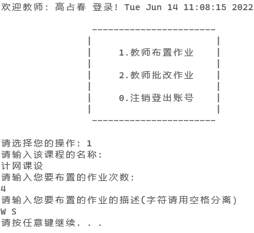
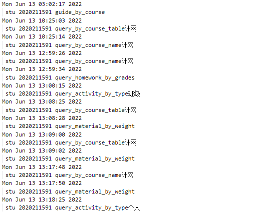
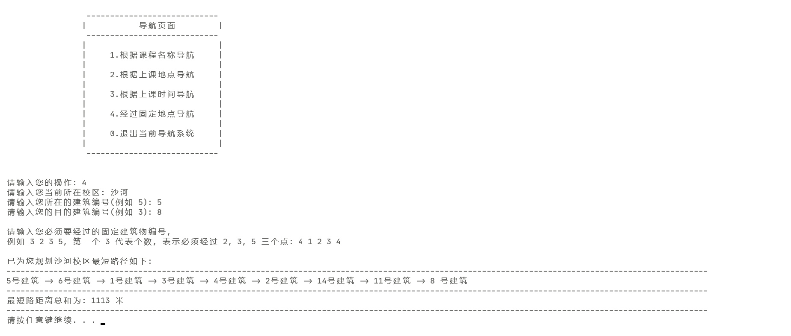

# 课程设计项目文档

- 周    宇 (2020211606)
- 任晓斌 (2020211592)
- 孟浩洋 (2020211591)

##   1. 功能需求报告
线下课程辅助系统可以帮助学生管理自己的课程和课外活动，具备课程导航功能、课程信息管理和查询功能，以及课外信息管理和查询功能等。为了模拟真实环境，我们需要在项目中自定校园建筑、校园内部道路图、课程和课外活动，并达到一定规模。在此基础上，用户需求可以可以分为以下 $6$ 个部分。
### 1.1. 课内信息管理
 需求：
-  学生可以输入课程名称，或者通过课程表查询课程的上课时间、上课地点、课程资料、当前进度、已交作业、待交作业、课程群、考试时间和考试地点等信息。
- 学生可以上传和更新课程资料、上传完成的作业内容。对于课程资料和作业可以进行查询、压缩和去重。
- 系统管理员统一发布考试时间和考试地点，并可以发布和更改课程上课的时间和上课地点。

 分析：
- 用户需要详细的课程内容相关信息，并且可以对课程内容中的有序信息按照不同关键字进行查询和排序，并且期望较高的效率，可以利用二叉搜索树和快速排序。
- 用户期望上传作业和资料文件，并且在系统中得到压缩，可以利用哈夫曼编码实现压缩。
- 管理员具有对文件进行修改的权限。
### 1.2. 课外信息管理
 需求：
- 学生可以输入课外活动信息，课外活动包括个人活动和集体活动；个人活动可以包括：自习、锻炼、外出等，集体活动可以包括：班会、小组作业、创新创业、聚餐等。
- 学生可以设定活动闹钟，闹钟可以是一次性的和周期性的，用于活动提醒。系统可以检测个人活动、集体活动和课程的时间冲突，并给出提示。

 分析：
- 可以复用类似于课内信息管理的数据结构和算法实现与课内信息管理相似的课外信息管理。
- 冲突检测要求判断活动区间是否与某个课程区间存在重叠，通过几何分析，可以仅利用区间中点和两端的坐标值进行判断。
- 闹钟需要多线程，与主线程并行进行。
### 1.3. 课程导航

需求：

校园导航模块实现所有课程设计中需求的功能，学生可根据多种方式进行导航，方式如下:

- 学生根据课程名称导航
- 学生根据上课时间导航
- 学生根据上课地点导航

同时学生导航可以有多种导航策略，而且考虑了跨校区等细节情况，方式如下:

- 最短距离策略导航
- 最短时间策略导航（考虑道路的拥挤度）
- 交通工具的最短时间策略（考虑不同的交通工具方式）

- 实现跨校区导航，自动识别是否需要跨校区进行路径规划

分析：

- 使用 Floyd 最短路算法实现各个策略和方式的导航功能
- 需要生成多张地图，适应有拥挤度的道路，以及考虑自行车道等交通情况
- 同时考虑学生用户跨校区导航等细节，实现跨校区交通方式规划等功能

### 1.4. 模拟系统时间
 需求：
-  系统依据时钟向前推进，时间精度为小时，且以计算机的 $10$ 秒作为模拟系统的 $1$ 小时（可以支持快进）；
    人机交互时暂停系统时间推进（例如用户输入信息时）；可以通过加入时钟暂停按钮或者命令来实现.

分析：

- 记录登录时刻，对当前时刻和登录时刻的时间差进行$360$倍放大。
- 用两个变量分别保存暂停开始和结束时刻，暂停状态下闹钟进程失效，恢复后用当前时间减去暂停总时长，系统完全保留了暂停前的状态
- 记录快进开始时刻，之后将时间差分成快进前部分和快进后部分，分别乘以不同的倍率，再与登录时刻求和作为当前模拟时刻。
### 1.5. 日志
 需求：
- 记录学生课程和活动状态变化，系统提醒的信息，输出的导航信息，以及学生输入的信息和各种查询操作。

 分析：
- 需要在每个功能完成后将其记录到 `log `目录日志文件中。


##   2. 总体方案设计报告

### 2.1. 项目结构

项目的文件目录树如下：

```
.
|-- CMakeLists.txt
|-- LICENSE
|-- README.md
|-- build
|   `-- cmake build files
|-- doc
|   |-- report.md
|   |-- course_model_report.md
|   `-- doc.md
|-- log
|   |-- stu
|   `-- stu.txt
`-- src
    |-- CMakeLists.txt
    |-- global_file.h
    |-- main.cpp
    `-- model
        |-- course_model
        |-- identity_model
        `-- navigation_model
```

- `src` 目录包含程序的所有源码, 主要为程序的所有模块。
- `log` 为程序的日志文件目录，包含所有程序运行日志文件。
- `doc` 为项目的文档目录，包含课程设计报告和程序文档。
- `build` 为使用 CMake 构建项目后生成的目录。

设计思路：

- 为了使得三种类型的用户能够实现各自的功能，将三类用户对应的模块进行明确地区分。
- 课内信息相关的需求以及导航的需求内容较多，同时可修改空间较大，为了便于迭代，作为单独的模块出现。
- 把所有菜单放在 `menu.cpp` 中，方便查找。
- 利用文件存储数据，相关文件操作具有可移植性，用户对数据的修改将会作用在文件上，实现可复用性。

### 2.2. 程序数据存储
1. 老师需要读取的信息文件

- 任课教师id为`y`,那么在`homework_set`下的`y_teacher`文件夹中的`course_collection`中存有教师教授课程的目录

2. 活动相关的本地文件

 - 学生个人活动信息放在 `identity_model` 下的 `activity_course_table` 文件夹中,对于id为 `x` 的学生，其所有活动信息存储在该文件夹下的 `x_activity_table.txt` 中

 - 班级活动信息放在 `identity_model` 下的 `group_set` 文件夹中,对于id为 `x` 的班级，其所有班级活动信息存储在该文件夹下的 `x_group.txt` 中

3. 课程相关的本地文件

 - 1.对于id为`x`的学生，在`identity_model`下的`x_activity_table.txt`中存储有基本的课程信息，通过这个文件学生可以生产课程表

 - 2.对于id为`y`的课程，在`course_model`下的`course_set`文件夹下面的`y_course.txt`中存储有该课程的全部公共信息

4. 作业相关的本地文件

 - 对于学生id `x`,其在任课教师id为`y`的课程id为`z`的课程的第`i`次作业的全部信息存储在`identity_model下的homework_set/y_teacher/z_course/i_times/
 x_stu`文件夹中

 - 压缩前的作业在该文件夹下的`hw.txt`,压缩后在`hw_zip.txt`,解压后作业在`hw_zip_unzip.txt`,作业分数与提交状态在`info.txt`中

5. 资料相关的本地文件

- 放在`identity-model`下面的`material_set`中

6. 用户信息相关的本地文件

- `identity_model`下的`admin_info.txt`中存储管理员id,密码

- `identity_model`下的`stu_info.txt`中存储学生id,密码,姓名,班级id

- `identity_model`下的`teacher_info.txt`中存储老师id,密码,姓名

7. 日志文件

- 存储在`log`文件夹中，对三类不同的用户各自设置了日志文件

8. 数据规模

- 项目设定为有 $1 $ 名管理员，$2$ 位老师，$10 $ 名学生，$12 $ 门课程，$20 $ 个活动，$2 $ 个校区，每个校区 $20$ 栋建筑。

9. 校园地图数据

- 地图数据全部位于导航模块目录下的 `*map.txt` 文件，具体文件内容参考课程设计报告详细说明。


## 3. 模块设计报告

### 3.1. 用户身份模块

#### 3.1.1. 学生部分
数据结构说明和数据字典

 - 1.`map<string, string name_to_id`

   在找到正确的名字后通过名字找到对应的课程下标，通过下标可以读取课程文件创建课程类

- 2.`map<int, pair<string, string  time_to_place`

   在找到合理的时间（大于输入时间的最新上课开始时间）后必须通过时间查找到对应的地名（校区+建筑），这样学生可以实现通过时间进行导航
- 3.`string my_course_table[6][12]`

   存储学生课程表
- 4.`Node t1[1000],Node t2[1000]`

    分别是用来存储课程时间和活动时间的二叉搜索树
- 5.`map<string, vector<single_activity  name_to_activity`

    在找到正确的名字后通过名字找到对应的活动
- 6.`map<int, vector<single_activity  time_to_activity`

     在找到正确的时间后通过时间找到对应的活动
- 7.`struct single_activity`

    存储活动信息的单元
- 8.`weekly_sys_time`

     模拟时间
- 9.`weekly_real_time`

    真实时间
- 10.`map<word_to_sen,map<word_to_par`

   字符到其所属字符串的有序映射表

算法：
- 利用二叉搜索树进行数据的查找，复杂度为 $O(logx)$

- 利用两区间中点的距离的绝对值和两区间总长度之间的大小关系方便的检测冲突
- Floyd 算法进行最短路计算
- 利用多线程以及时间差的存储，缩放实现模拟系统时钟的暂停和快进
- 将所有组成可能被搜索的名字中的字符存进内存，与用户输入进行匹配来实现模糊查询；
- 搜索复杂度低至 $O(klogn)$ ( $k$ 为搜索字符长度，$n$ 为全部字符长度)

实现的功能：

- 1.课程名称模糊查询  
  
 -   2.课表课程查询    
     
 -  3.课程时间查询    
    
-   4.活动名称模糊查询    
    
 -   5.进入活动菜单（进入后可以对个人活动增删改，还可以对活动按照类别进行查找后按照时间排序)    
     
-    6.活动时间查询    
     
 -    7.进行路径导航 

 -  8.模拟时间暂停

 - 9.模拟时间快进
 - 10.活动闹钟提醒 (以模拟时间为准，通过输出 `\a` 模拟闹铃)


  与其他模块交互

 - 1.可以通过课表查询或者课程名称查询创建course实例，完成学生所需要的与课程有关的功能 
 - 2.与活动相关的功能都在本模块内部实现
 - 3.通过路径导航功能可以创建guide实例，实现学生的导航需求

 #### 3.1.2. 管理员用户
 数据结构说明和数据字典
- 1.`struct single_course_a` 一堂课
- 2.`whole_course_a` 一门课
- 3.`single_activity_a` 一次活动

实现的功能
- 1.班级活动菜单（对班级活动进行增加和删除）

- 2.发布新的课程
- 3.修改原有课程
- 4.根据活动类型进行查找并且将结果按照时间排序

与其他模块交互
- 管理员对文件的修改将会影响到其他用户在之后读取各种数据的情况
#### 3.1.3. 教师用户
数据结构说明和数据字典：
- `map<string, string name_to_id` 存储从文件中读到的课程名和`id`的映射

算法：
- 解压缩

实现的功能：
- 发布作业
- 批改作业

与其它模块的交互：：

- 发布作业后选了该课程的所有学生在 `homework_set` 中会多出一份作业文件夹，学生可以在下一次进入该课程页面后发现老师布置了作业
- 批改作业后会把分数写入 `info` 文件，学生可以在下一次进入该课程页面后看到老师给这次作业多少分
### 3.2. 学生课程模块
数据结构说明和数据字典：
  - 1.`struct single_course`

     存储一堂课的单元
  - 2.`struct material`

     存储一份电子资料的单元（包含权重信息）
- 3.`struct hw`

    存储一份作业信息的单元（包含成绩信息）
- 4.`vector<int order_hws`

    以成绩为关键字进行快速排序时，存放排序结果的下标
- 5.`vector<int order_materials`

     以权重为关键字进行快速排序时，存放排序结果的下标

实现的功能：

 - 1.提交课程作业  

 -  2.提交课程资料                            
- 3.下载课程资料    
- 4.作业名称模糊查询   
 -   5.作业成绩排序    
 - 6.资料名称模糊查询   
  - 7.资料权重排序

算法：

- 以下标转换为基础的快速排序，既可以节省空间，又提高效率
与其他模块交互
- 学生用户可以在个人主页中通过课程表选定课程或者通过搜索来创建课程类实例并进入课程界面实现课程提供的各种功能

### 3.3. 校园导航模块

#### 3.3.1. 模块设计概览

导航模块所有函数实现，以及类的定义参考 `navigation_model/guide.h` 头文件：

```cpp
class Guide {
   public:
    int build_now;      //现在所处的建筑位置
    string campus_now;  //现在所处的校区 沙河 西土城
    string stu_id;      //当前操作的学生的学号

    Guide();
    Guide(string in_campus, string stu_id);  //现在所处的校区 当前操作学生的学号
    Guide(string stu_id);                    // 当前操作学生的学号

    void build_graph(string campus_now);  //每次导航时候都要先建图 放入内存中

    void guideOperMenu();                 //导航选择菜单
    void print_path_by_course();          //根据课程名称导航
    void print_path_by_location();        //根据上课地点导航 考虑不同校区
    void print_path_by_time();            //根据上课时间导航
    void print_path_by_fixed_building();  //选做算法 经过固定建筑(同校区内的建筑)
};
```

#### 3.3.2. 模块功能概览

此模块实现所有学生用户需要导航的的功能，学生可根据多种方式进行导航，方式如下:

- 学生根据课程名称导航
- 学生根据上课时间导航
- 学生根据上课地点导航

同时学生导航可以有多种导航策略，而且考虑了跨校区等细节情况，方式如下:

- 最短距离策略导航
- 最短时间策略导航（考虑道路的拥挤度）
- 交通工具的最短时间策略（考虑不同的交通工具方式）

- 实现跨校区导航，自动识别是否需要跨校区进行路径规划

具体每个功能的实现细节，以及代码细节分析，文档后续会详细说明。

#### 3.3.3. 主要算法设计

在各种不同策略和要求的最短路实现代码中，均采用 [Floyd 算法](https://en.wikipedia.org/wiki/Floyd%E2%80%93Warshall_algorithm)来预处理出全源最短路，且以文件保存所有预处理好的最短路结果，每次导航只需快速查询即可，不用每次导航都跑一次最短路算法。对于选做部分的算法，使用 Floyd 算法以及动态规划算法，实现在线算法，高效规划导航路线。


## 4. 程序测试报告

### 4.1. 用户身份模块测试

- 管理员修改考试时间


- 管理员发布班级活动


- 课程名称查询


- 活动类型查询

  

- 学生设置活动

  

- 课程课表查询

  

- 活动名称查找

  

  

  

  

  

### 4.2. 课程管理模块测试

- 文本内容压缩解压测试效果：


---------
- 教师批改作业：


- 教师布置作业测试：



- 提交课程资料


- 资料权重排序

  

- 作业名称查询

  

  

- 日志记录截取测试：



### 4.3. 校园导航模块测试

课表文件位于项目 `src/model/identity_model/course_table` 目录下，下面以学生 $2020211591$ 的课表为例进行导航的所有功能测试和分析。

首先运行程序，以账号 $2020211591$ ，密码 $123$ 登录进入系统:


然后在学生菜单中选择选项 $7$ "进行路径导航"，键入回车后即可进行各种导航功能测试。


#### 4.3.1. 根据课程名称导航

在这个需求中，学生输入需要查询的上课名称，然后系统即可规划同时输出最短路策略。

首先来看程序的演示执行效果，在导航菜单中键入 $1$ 进行根据课程名称导航:


回车之后，系统首先会检索当前学生 $2020211591$ 的课表，全部列出该学生本学期的课程，如下:


比如我们输入当前正在上的课程《计网》，然后 输入接下来要上的课程《毛概》，键入回车之后，系统首先会自动识别是否需要跨校区上课，然后再输出导航规划的路径，对于这两门课，根据上面说的课表文件可知，是不需要跨校区的，都在沙河校区上课，所以输出结果如下：


导航会同时输出所有情况和策略下的最短路规划方案，供学生选择，比如最短步行距离策略，最短步行时间策略，以及通过骑自行车的交通方式，走自行车道的路线和所需时间。

然后再测试一个需要跨校区上课的例子，比如输入当前正在上的课程为《毛概》，接下来要上的课程为《Java》，输出结果如下：


此时系统会同时加上跨校区导航，也就是从沙河校区至西土城校区，或者从西土城校区至沙河校区的导航规划。

同时提供定点班车路线: 北邮沙河校区->沙河公交站->马甸桥东公交站->蓟门桥南公交站->北邮海淀校区

校车途径路线: 北邮沙河校区->沙河公交站->京藏高速沙河收费站->京藏高速->马甸桥->北邮海淀校区

同样地，选择当在西土城校区上课，然后接下来要上的课输入一门沙河校区的，会以同样的逻辑进行导航，这里就不再赘述。

#### 4.3.2. 根据上课地点导航

在此功能需求中，学生需要输入上课的地点，系统为学生输出路径规划方案。

- 上课地点是上课的物理位置（例如 沙河 2号楼208）

- 起点和终点可以在不同校区，需要考虑校区间的交通方式；

- 校区间的交通方式为：定点班车（可以自行规划班次时刻表）和公共汽车（可等间隔发车）。

首先是程序执行的演示效果如下，和根据课程名称导航一样，系统会自动识别是否需要跨校区进行导航，如果不需要跨校区就输出在本校区内的导航，我们就以一个比较复杂的跨校区例子来演示, 同样来到导航选择菜单：


我们输入操作选项 $2$ 进行根据上课地点来导航，然后接着输入当前所在的上课地点，以及接下来所要去的上课地点。在图示的测试样例中，我们输入当前位于沙河校区 2 号楼 208，将要抵达西土城校区 8 号楼 104 进行上课。

导航自动识别到需要跨校区，先输出校区间的导航路径，包括校车以及定点班车的方案。

然后分别输出所有导航策略，包括最短路径，最短时间，不同交通方式策略下的最短路径规划方案:


#### 4.3.3. 根据上课时间导航

在此功能需求中，需要学生输入打算上课的时间，然后系统为学生查询距离此时间最近的课程。如果当天已无课程，会提示学生输入改天的时间。上课时间可以是 “周五10点30分（Fri 10:30) ” 系统会自动更据学生的班级信息和最近的上课时间（未开始）查询上课地点。

首先是程序执行的演示效果如下，和根据课程名称导航一样，系统会自动识别是否需要跨校区进行导航，如果不需要跨校区就输出在本校区内的导航，我们就以一个比较复杂的跨校区例子来演示, 同样来到导航选择菜单：


学生用户先输入当前所在校区以及当前所在的建筑编号，方便导航系统定位。然后学生需要输入自己打算上课的时间，比如周五早上 10:30 分，此处注意输入格式，使用英文星期，随后系统便开始导航规划路径输出如下:


导航效果如上图所示，系统首先会根据学生用户输入的上课时间，为学生查询到最近还未开始上的课程，包括这门课的校区（上图显示为西土城），这门课在目的校区所在的建筑编号（上图显示为西土城校区 3号楼），以及这门课的名称（上图显示为 PHP 语言基础）。接下来会根据是否需要跨校区导航，分别输出所有导航策略，包括最短路径，最短时间，不同交通方式策略下的最短路径规划方案。

#### 4.3.4. 途径多个地点的导航

在此功能需求中，需要实现通过学生用户指定必须经过的建筑编号来规划从起点到终点的最短路。

首先进入导航菜单，键入选项 $4$ 选择经过固定点的导航，然后回车：



首先输入当前所在校区，便于系统定位。接着输入当前所在建筑，以及目的所在建筑的编号，最后输入必须经过的建筑：先输入必须经过建筑的数量，然后依次输入每个必须经过的建筑编号。如上图所示样例，学生当前在 $5$ 号建筑，导航前往 $8$ 号建筑，途中必须经过 $4$ 个点，分别为 $1,2,3,4$ 号建筑。最后导航输出规划好的最短路径。


## 5. 数据结构说明报告

5.1 二叉搜索树
- 二叉搜索树在学生模块中，用于查找用户输入的时刻的后继（大于等于该时刻的最小时刻），如果有`n`个表项，查找时间复杂度度 $O(log n)$。

5.2 模拟时钟结构体(`weekly_sys_time`)

- 模拟时钟结构体在学生模块中，用于真实时间和实际时间之间的相互转化，可以实现快进、暂停等功能，快进前后都可以精确到分。
通过创建模拟时钟结构体数组`T`，我们可以用` T[0] ` 记录登录时刻，`T[1] `记录当前时刻，`T[2]` 记录快进开始时刻，`T[3]、T[4]` 记录暂停开始和结束时刻。

5.3 字符到包含该字符的字符串的 C++`std::map`
- 这个`map`位于学生模块中，包含 `x` 项，用于模糊查找，`map`内部使用红黑树，在查找时通过对输入的 `k` 个字符作为 `key`,查找对应的`value`,可以以 `O(kln x) `时间复杂度实现模糊查找。

5.4 哈夫曼树

- `struct zipnode {  int val;   char ch; zipnode -l, -r;}`，其中`ch`存放字母，`val `存放的字母对应的权值，`l,r`分别为左右子节点。压缩算法中，将压缩生成树的信息写入压缩文件，解压缩时候可以通过读取文件获得压缩时的信息，简化了解压缩的流程。

5.5 图的存储

- 考虑到只有 $20$ 规模数量的建筑，同时使用 Floyd 算法实现，对于在线实现的最短路算法，使用邻接矩阵来存储图中数据。对于导航查询功能，预先离线处理最短路，存储在导航模块目录下的 `*path.txt` 文件中，便于快速查询最短路进行路径输出。

5.6 AC 自动机

- 此数据结构实现用于字符串的多模式快速匹配，从而实现作业文本内容的查重，具体实现位于用户身份模块下的 `teacher.cpp` 查重函数中：

```cpp
 void check_duplicate(string course_id, int times, vector<string> v);  //作业查重
```


## 6. 评价和改进意见报告
- 本项目为单机版，难以被实际线上运用，在本学期计网知识的学习之后，我们可以考虑拓展该项目为 CS 或者BS 架构，达到允许多用户同时线上操作的目的。

- 闹钟的响应进程为了实现声音播放的功能，有较为漫长的执行时间，这导致在登出时主进程不能立即退出，而是要等待一段时间。我们可以进一步考虑改变声音的播放方式，可以在项目中插入音频文件进行播放，这样就不会出现进程周期过长的问题。

- 压缩与解压缩时，最初考虑了对中文的压缩与解压缩，尝试了使用utf-8编码的形式以及穷举法，将汉字转化成拼音再去储存。但由于汉字具有多音字，很难处理，以及经常出现乱码等问题而放弃，浪费了很多时间。

- C++ 中所有字符以非等长编码形式存储，这导致我们在处理中文文本和中文输入交互时遇到了非常大的困难。最终我们只能要求用户输入待查找字符串时必须用空格将每个字符分离，并且在压缩文本时只能处理无中文的文本。而  Java 字符全部采用 Unicode 编码，所有字符等长，而且在进行网络通信时有较大优势，考虑到用户在网络和字符处理方面的需求，我们应该在项目初始构建时优先考虑 Java 语言。我们可以考虑将本项目全部移植到  Java  语言中来完善字符处理能力和，但这又是一个很大的挑战。


## 7. 用户使用说明报告

###  7.1. 管理员用户
可以大量的进行数据修改，并与文件进行交互，应该注意修改时要严格按照输入格式要求进行输入，否则会使得输入难以识别，或者文件被破坏。其主要操作如下：
- 1.班级活动菜单（对班级活动进行增加和删除）
- 2.发布新的课程
- 3.修改原有课程
### 7.2. 教师用户
发布作业：
- 教师输入作业的相关描述即可。

批改作业：

- 教师通过对某一任教课程的某一次作业进行集中解压，得到目标文件，之后教师可以进入文件系统查看作业，批改完毕后在系统中输入分数即可。

###  7.3. 学生用户

课内信息管理：
- 1.课程名称查询   
- 2.课表课程查询    
- 3.课程时间查询   
- 4.提交课程作业 
- 5.提交课程资料                            
- 6.下载课程资料    
- 7.作业名称查询   
- 8.作业成绩排序    
- 9.资料名称查询   
- 10.资料权重排序

课外信息管理：
-   1.活动名称查询       
-   2.进入活动菜单（进入后可以对个人活动增删改,并且可以对课程类别进行查询后按照时间排序)        
-    3.活动时间查询

路径导航：

- 学生根据课程名称导航
- 学生根据上课时间导航
- 学生根据上课地点导航
- 最短距离策略导航
- 最短时间策略导航（考虑道路的拥挤度）
- 交通工具的最短时间策略（考虑不同的交通工具方式）
- 实现跨校区导航，自动识别是否需要跨校区进行路径规划

时钟模拟与闹钟：
-  1.模拟时间暂停
-  2.模拟时间快进
-  3.活动闹钟提醒 (以模拟时间为准，通过输出`"\a"`模拟闹铃)


​     