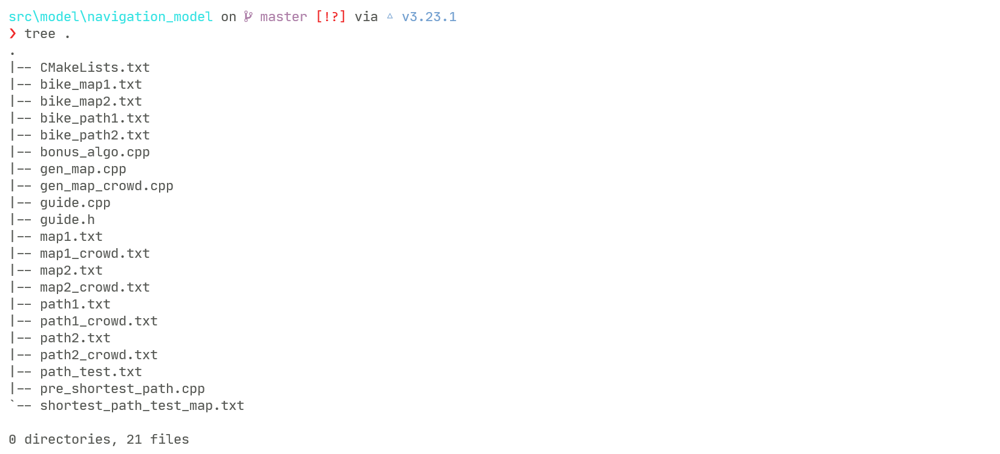

### 3.3. 校园导航模块

_此模块代码实现和报告/文档撰写由（2020211592 任晓斌）实现_

#### 3.3.1 需求实现概述

校园导航模块实现了所有课程设计中需求的功能，学生可根据多关键字进行导航，方式如下:

- 学生根据课程名称导航
- 学生根据上课时间导航
- 学生根据上课地点导航

同时学生导航可以有多种导航策略，而且考虑了跨校区等细节情况，方式如下:

- 最短距离策略导航
- 最短时间策略导航（考虑道路的拥挤度）
- 交通工具的最短时间策略（考虑不同的交通工具方式）

- 实现跨校区导航，自动识别是否需要跨校区进行路径规划

具体每个功能的实现细节，以及代码细节分析，文档后续会详细说明。

#### 3.3.2. 核心算法概述

在各种不同策略和要求的最短路实现代码中，均采用 [Floyd 算法](https://en.wikipedia.org/wiki/Floyd%E2%80%93Warshall_algorithm)来预处理出全源最短路，且以文件保存所有预处理好的最短路结果，每次导航只需快速查询即可，不用每次导航都跑一次最短路算法。

为什么采用预预处理全源最短路，而不是每次导航都跑一次 Dijkstra 或者其它单源最短路算法呢？我们先分析一下每次导航都要跑 Dijkstra 算法的时间和空间复杂度。朴素实现的 Dijkstra 算法时间复杂度为 $O(mn)$, 其中 $m$ 为图中的边数，$n$ 为图中的点数。考虑每次导航时如果在线建图一次，其 I/O 所用时间已经是近似 $O(n^2)$ 时间复杂度, 且导航在系统中是较为常用的部分，需要频繁调用。

所以综上考虑，使用 Floyd 算法只需要一次预处理以 $O(n^3)$ 的时间花费即可求出整个地图的全源最短路，因为地图在后续的系统运行中是不会再被修改的，所以我们将预处理出的结果保存下来查询即可。

#### 3.3.3. 需求实现代码细节分析

接下来对导航模块中所有项目需求详细讲述源代码，实现思路，以及执行效果。在地图中，我们约定保留 $1$ 号建筑物为校门, 所有建筑设施的编号均在 $1 \sim 20$ 内, 所有课程导航**只按照在课表中有课的建筑**之间进行路径导航。

导航模块源码目录树:



- `guide.cpp` 为导航主要的代码，除了选做算法之外所有的导航功能均在此文件源码实现。
- `*map.txt` 文本文件均为静态生成的地图，使用所有 `gen_map*.cpp` 程序生成各种需求地图。
- `bonus_algo.cpp` 为此项目的选做算法，规划出经过固定点的最短路径。
- `*path.txt` 为提前使用最短路算法处理好的最短路径，输出路径时直接查询即可。

课表文件位于项目 `src/model/identity_model/course_table` 目录下，下面以学生 $2020211591$ 的课表为背景进行导航的所有功能测试和分析。

首先运行程序，以账号 $2020211591$ ，密码 $123$ 登录进入系统:


然后在学生菜单中选择选项 $7$ "进行路径导航"，键入回车后即可进行各种导航功能测试。


##### 3.3.3.1. 根据课程名称导航

在这个需求中，学生输入需要查询的上课名称，然后系统即可规划同时输出最短路策略。

首先来看程序的演示执行效果，在导航菜单中键入 $1$ 进行根据课程名称导航:


回车之后，系统首先会检索当前学生 $2020211591$ 的课表，全部列出该学生本学期的课程，如下:


比如我们输入当前正在上的课程《计网》，然后 输入接下来要上的课程《毛概》，键入回车之后，系统首先会自动识别是否需要跨校区上课，然后再输出导航规划的路径，对于这两门课，根据上面说的课表文件可知，是不需要跨校区的，都在沙河校区上课，所以输出结果如下:


导航会同时输出所有情况和策略下的最短路规划方案，供学生选择，比如最短步行距离策略，最短步行时间策略，以及通过骑自行车的交通方式，走自行车道的路线和所需时间。

然后再测试一个需要跨校区上课的例子，比如输入当前正在上的课程为《毛概》，接下来要上的课程为《Java》，输出结果如下：


此时系统会同时加上跨校区导航，也就是从沙河校区至西土城校区，或者从西土城校区至沙河校区的导航规划，

同时提供定点班车路线: 北邮沙河校区->沙河公交站->马甸桥东公交站->蓟门桥南公交站->北邮海淀校区

以及校车途径路线: 北邮沙河校区->沙河公交站->京藏高速沙河收费站->京藏高速->马甸桥->北邮海淀校区

同样地，选择当在西土城校区上课，然后接下来要上的课输入一门沙河校区的，会以同样的逻辑进行导航，这里就不再赘述。以上就是以课程名称导航的执行效果，接下来分析这部分实现的代码和思路。

- `Guide` 导航类的声明, 源码位于当前模块目录下的 `guide.h`

```cpp
class Guide {
   public:
    int build_now;      //现在所处的建筑位置
    string campus_now;  //现在所处的校区 沙河 西土城
    string stu_id;      //当前操作的学生的学号

    Guide();
    Guide(string in_campus, string stu_id);  //现在所处的校区 当前操作学生的学号
    Guide(string stu_id);                    //当前操作学生的学号

    void build_graph(string campus_now);  //每次导航时候都要先建图 放入内存中

    void guideOperMenu();                 //导航选择菜单
    void print_path_by_course();          //根据课程名称导航
    void print_path_by_location();        //根据上课地点导航 考虑不同校区
    void print_path_by_time();            //根据上课时间导航
    void print_path_by_fixed_building();  //选做算法 经过固定建筑(同校区内的建筑)
};
```

这里声明了所有导航模块中的函数，功能由其后的注释说明，这一部分先讲述根据课程名称导航的函数细节。

- `void Guide::print_path_by_course()` 根据课程名称导航

在函数开始，我们先读入需要的数据，比如学生的课表信息，课表里面包含了每门课的名称，上课地点，建筑的编号等等，我们分别使用哈希表 `std::map` 来映射存储，这样每次查询都可以 $O(logN)$ 复杂度快速查询信息。

```cpp
//课程表信息
//存入课程对应的建筑编号
map<string, int> mp;
map<string, string> campus_map;  //课程 课程所在校区
set<string> all_course;
//星期 第几节 教室 课程名称 所在校区 课程编号 教室所在建筑
string file_date, file_classroom, file_course_name, file_campus;
int file_class_number, name_length;
string file_course_id, garbage;
int file_building_id;
while (ifs >> file_date >> file_class_number >> file_classroom >> file_course_name >> file_campus >> file_course_id >> file_building_id >> name_length) {
    for (int z = 1; z <= name_length; z++) {
        ifs >> garbage;
    }
    mp[file_course_name] = file_building_id;
    campus_map[file_course_name] = file_campus;  //所在校区
    all_course.insert(file_course_name);
}
```

存储信息的核心代码如上，使用哈希表 `map<string, int> mp` 以及 `map<string, string> campus_map` 分别存储课程名称对应的建筑编号，以及课程名称对应的校区之间的映射关系。

接下来就是学生用户输入当前正在上课的名称，以及接下来要上课的名称，由于课程名称和其所在的建筑编号都已经保存在哈希表中，所以此时可以快速查询出这两门课所在的建筑编号，这样就可以查询已经求出的最短路径，然后输出就行了，代码如下：

- 首先根据校区关键字判断是否需要跨校区导航

```cpp
cout << "\n请输入您正在上的课程名称: ";
string course_go_on;
cin >> course_go_on;

cout << "请输入您将要上课的课程名称: ";
string course_name;
cin >> course_name;

bool flag_shahe_xitu = false;  //沙河->西土城 跨校区
bool flag_xitu_shahe = false;  //西土城 -> 沙河 跨校区
string cps_now = campus_map[course_go_on];
string cps_next = campus_map[course_name];
if (cps_now == cps_next && cps_now == "沙河") {
    cout << "\n已查询到您不需要跨校区上课, 当前为沙河校区内导航: \n";
    this->campus_now = "沙河";
} else if (cps_now == cps_next && cps_now == "西土城") {
    cout << "\n已查询到您不需要跨校区上课, 当前为西土城校区内导航: \n";
    this->campus_now = "西土城";
} else if (cps_now == "沙河" && cps_next == "西土城") {
    flag_shahe_xitu = true;
    this->campus_now = "西土城";
    cout << "\n已查询到您需跨校区上课, 将从沙河校区出发前往西土城校区: \n";

    // cout << "已到达西土城\n\n";
} else if (cps_now == "西土城" && cps_next == "沙河") {
    flag_xitu_shahe = true;
    this->campus_now = "沙河";
    cout << "\n已查询到您需跨校区上课, 将从西土城校区出发前往沙河校区: \n";

    // cout << "已到达沙河\n\n";
}
```

- 读取地图数据文件，然后找到建筑编号

```cpp
int now_build_id = mp[course_go_on];  //当前所在校区的建筑
int next_build_id = mp[course_name];  //目的校区所在建筑

ifstream iifs;
string path_file;

if (this->campus_now == "沙河")
    path_file = "../../src/model/navigation_model/path1.txt";  //沙河校区
else
    path_file = "../../src/model/navigation_model/path2.txt";  //西土城
```

接下来就是输出不同的导航策略下的路径规划方案，由于最短路径我们是已经预处理好的，所以只需要读取对应导航策略的路径数据文件然后输出方案即可，比如走自行车道的最短路方案在文件 `*bike_path.txt` 中。

- 最短距离策略

没有任何限制，没有拥挤度的最短距离路径预处理保存在文件 `path1.txt`(沙河校区)，以及 `path2`(西土城校区)

```cpp
for (std::string line; std::getline(iifs, line);) {
    vector<string> v;  //去掉空格分开之后的所有单独建筑编号
    string temp = "";

    for (int i = 0; line[i]; i++) {
        if (!isspace(line[i]))
            temp += line[i];
        else {
            while (isspace(line[i])) i++;
            i--;
            v.push_back(temp);
            temp = "";
        }
    }
    v.push_back(temp);

    if (stoi(v[0]) == now_build_id && stoi(v[1]) == next_build_id) {
        // cout << line << endl;
        for (int i = 2; i < (int)(v.size() - 2); i++) 
            cout << (v[i] == "1" ? (cps_next + "校门 -> ") : v[i] + " 号教学楼 -> ");
        cout << v[v.size() - 2] + " 号教学楼" << endl;
        cout << "----------------------------------------------------------\n";
        cout << "最短步行路线总长度: " << v[v.size() - 1] << " 米" << endl;
        break;
    }
}
```

输出规划路径的代码如上所示，本质逻辑就是线性复杂度 $O(n)$ 遍历最短路方案，然后输出即可。

- 最短时间策略

在最短时间策略中，我们对地图道路附加上拥挤度属性，此部分导航按照课设要求不考虑跨校区。道路的拥挤度采用随机数赋予，道路拥挤程度程度使用整数范围在 $[1,3]$ 内表示，生成具有拥挤度的源码位于 `gen_map_crowd.cpp`, 生成地图的核心代码如下:

```cpp
void gen() {
    std::random_device seed;
    std::mt19937 rand(seed());
    std::uniform_int_distribution<int> dist(0, 999); //距离，单位为米，随机距离 [1,1000]
    std::uniform_int_distribution<int> building_id(0, 19);  //建筑编号 [1,20]
    std::uniform_int_distribution<int> crowdedness(0, 2);  //道路拥挤程度 [1,3]

    ofstream ofs;
    ofs.open("map2_crowd.txt");

    //选210条边
    //建筑距离>50m的才符合实际
    int cnt = 0;
    while (1) {
        int build1 = building_id(rand) + 1;
        int build2 = building_id(rand) + 1;
        int random_dist = (dist(rand) + 1) * (crowdedness(rand) + 1); //距离*拥挤度
        if (random_dist < 50) continue;
        if (build1 == build2) continue;  //排除自环的情况
        cnt++;
        ofs << build1 << ' ' << build2 << ' ' << random_dist << endl;
        if (cnt >= 210) break;
    }
    ofs.close();
}
```

根据上述有拥挤度的地图，预处理最短路方案的文件为 `path*_crowd.txt` 所以在查询最短路方案时查询这些文件 。输出最短时间方案的核心代码如下:

```cpp
//最短时间策略，重新生成地图考虑拥挤度 不考虑跨校区 步行不考虑交通方式
//输出步行时间 步速 1.5m/s

string crowd_path_file;
if (this->campus_now == "沙河")
    crowd_path_file = "../../src/model/navigation_model/path1_crowd.txt";  //沙河校区
else
    crowd_path_file = "../../src/model/navigation_model/path2_crowd.txt";

ifstream ifs_crowd;
ifs_crowd.open(crowd_path_file, ios::in);
if (!ifs_crowd.is_open()) {
    cout << "拥挤度路径寻找文件不存在!" << endl;
    system("pause");
    return;
}

cout << "最短步行时间路线如下: \n";
cout << "------------------------------------------------\n";
for (std::string line; std::getline(ifs_crowd, line);) {
    vector<string> v;  //去掉空格分开之后的所有单独建筑编号
    string temp = "";

    for (int i = 0; line[i]; i++) {
        if (!isspace(line[i]))
            temp += line[i];
        else {
            while (isspace(line[i])) i++;
            i--;
            v.push_back(temp);
            temp = "";
        }
    }
    v.push_back(temp);

    if (stoi(v[0]) == now_build_id && stoi(v[1]) == next_build_id) {
        // cout << line << endl;
        for (int i = 2; i < (int)(v.size() - 2); i++) cout << (v[i] == "1" ? (cps_next + "校门 -> ") : v[i] + " 号教学楼 -> ");
        cout << v[v.size() - 2] + " 号教学楼" << endl;
        cout << "------------------------------------------------\n";
        cout << "最少步行所需时长约 " << 
            stoi(v[v.size() - 1]) * 1.0 / 1.5 << " 秒" << endl;
        break;
    }
}
```

- 交通工具策略导航

此导航策略要求校区内选择自行车时，只能走自行车道路，默认自行车在校区任何地点都有；在考虑不同拥挤度的情况下时间最短；对应的地图文件位于 `bike_map*.txt` ，预处理求出的最短路方案位于文件 `bike_path*.txt` 中，输出走自行车道的导航方案核心代码如下:

```cpp
//交通工具策略 考虑新地图 自行车道 考虑拥挤度
//自行车道重新生成地图
//只需要最短时间，行驶速度为 4m/s
//自行车道地图 bike_map1.txt bike_map2.txt bike_path1.txt bike_path2.txt
string bike_path_file;
if (this->campus_now == "沙河")
    bike_path_file = "../../src/model/navigation_model/bike_path1.txt";  //沙河校区
else
    bike_path_file = "../../src/model/navigation_model/bike_path2.txt";

ifstream ifs_bike;
ifs_bike.open(bike_path_file, ios::in);
if (!ifs_bike.is_open()) {
    cout << "自行车道路径寻找文件不存在!" << endl;
    system("pause");
    return;
}

cout << "自行车道最短时间路线如下: \n";
cout << "-------------------------------------------------------\n";
for (std::string line; std::getline(ifs_bike, line);) {
    vector<string> v;  //去掉空格分开之后的所有单独建筑编号
    string temp = "";

    for (int i = 0; line[i]; i++) {
        if (!isspace(line[i]))
            temp += line[i];
        else {
            while (isspace(line[i])) i++;
            i--;
            v.push_back(temp);
            temp = "";
        }
    }
    v.push_back(temp);

    if (stoi(v[0]) == now_build_id && stoi(v[1]) == next_build_id) {
        // cout << line << endl;
        for (int i = 2; i < (int)(v.size() - 2); i++) 
            cout << (v[i] == "1" ? (cps_next + "校门 -> ") : v[i] + " 号教学楼 -> ");
        cout << v[v.size() - 2] + " 号教学楼" << endl;
        cout << "-------------------------------------------------\n";
        cout << "最少骑车所需时长约 " << 
            stoi(v[v.size() - 1]) * 1.0 / 4.0 << " 秒" << endl;
        break;
    }
}
```

以上就是学生用户根据课程名称关键字进行导航，其核心代码逻辑的分析和说明。


##### 3.3.3.2. 根据上课地点导航

在此功能需求中，学生需要输入上课的地点，系统为学生输出路径规划方案。

- 上课地点是上课的物理位置（例如 沙河 2号楼208）

- 起点和终点可以在不同校区，需要考虑校区间的交通方式；

- 校区间的交通方式为：定点班车（可以自行规划班次时刻表）和公共汽车（可等间隔发车）。

首先是程序执行的演示效果如下，和根据课程名称导航一样，系统会自动识别是否需要跨校区进行导航，如果不需要跨校区就输出在本校区内的导航，我们就以一个比较复杂的跨校区例子来演示, 同样来到导航选择菜单：


我们输入操作选项 $2$ 进行根据上课地点来导航，然后接着输入当前所在的上课地点，以及接下来所要去的上课地点。在图示的测试样例中，我们输入当前位于沙河校区 2 号楼 208，将要抵达西土城校区 8 号楼 104 进行上课。

导航自动识别到需要跨校区，先输出校区间的导航路径，包括校车以及定点班车的方案。

然后分别输出所有导航策略，包括最短路径，最短时间，不同交通方式策略下的最短路径规划方案:


接下来我们讲述此功能实现的代码细节，同样的，和根据课程名称导航的函数类似，我们先读取学生课程表信息，然后使用哈希表分别存储上课教室和其所在对应的建筑编号，以及上课教室和其所在上课的校区之间的映射关系 ，这样对于 C++ 中的 `std::map` 我们每次都可以高效 $O(logN)$ 时间复杂度查询到建筑编号，进行导航。

```cpp
//课程表信息
//存入课程对应的建筑编号
map<string, int> mp;  //具体教室 教室所在建筑编号
// map<string, string> campus_map;  //具体教室 教室所在校区
set<string> all_course;
//星期 第几节 教室 课程名称 所在校区 课程编号 教室所在建筑
string file_date, file_classroom, file_course_name, file_campus;
int file_class_number, name_length;
string file_course_id, garbage;
int file_building_id;
while (ifs >> file_date >> file_class_number >> file_classroom >> file_course_name >> file_campus >> file_course_id >> file_building_id >> name_length) {
    for (int z = 1; z <= name_length; z++) {
        ifs >> garbage;
    }
    mp[file_classroom] = file_building_id;
    // campus_map[file_course_name] = file_campus;  //所在校区
    all_course.insert(file_course_name);
}
```

这部分代码其实也是和上面根据课程名称导航部分唯一不同地方，我们使用哈希表维护的查询信息不同，一个是根据课程名称，此处是根据上课地点。其余的代码均完全复用即可，因为导航最本质的逻辑都是要归到建筑的编号上，不论根据什么导航，我们先想办法找到目的的建筑编号，然后其余的代码逻辑完全照搬复用即可，此功能后续实现部分完全参考上面根据课程名称导航的讲述，以及源码的注释即可。

还有就是需要注意一点，对于课表中没有课的建筑，导航系统是读取不到建筑信息的，所以也就无法输出路线，在测试样例中**请务必根据学生课表信息的课程进行导航，请勿随意输入建筑设施的编号**。


##### 3.3.3.3. 根据上课时间导航

在此功能需求中，需要学生输入打算上课的时间，然后系统为学生查询距离此时间最近的课程。如果当天已无课程，会提示学生输入改天的时间。

上课时间可以是 “周五10点30分（Fri 10:30) ” 系统会自动更据学生的班级信息和最近的上课时间（未开始）查询上课地点。

首先是程序执行的演示效果如下，和根据课程名称导航一样，系统会自动识别是否需要跨校区进行导航，如果不需要跨校区就输出在本校区内的导航，我们就以一个比较复杂的跨校区例子来演示, 同样来到导航选择菜单：


学生用户先输入当前所在校区以及当前所在的建筑编号，方便导航系统定位。然后学生需要输入自己打算上课的时间，比如周五早上 10:30 分，此处注意输入格式，使用英文星期，随后系统便开始导航规划路径输出如下:


导航效果如上图所示，系统首先会根据学生用户输入的上课时间，为学生查询到最近还未开始上的课程，包括这门课的校区（上图显示为西土城），这门课在目的校区所在的建筑编号（上图显示为西土城校区 3号楼），以及这门课的名称（上图显示为 PHP 语言基础）。接下来会根据是否需要跨校区导航，分别输出所有导航策略，包括最短路径，最短时间，不同交通方式策略下的最短路径规划方案。

接下来我们讲述这部分代码实现的细节和逻辑。学生课表的作息时间完全使用北邮计算机学院大二下学期的课表作息，这里使用我自己的课表作息时间来模拟系统时间，如下图所示：


系统首先根据学生输入的时间，来查找最近未开始上的课，如果当天已无课程，会提示学生输入改天的时间。对于世界的查找，代码具体实现的逻辑就是很简单的判断输入的时间落入哪个课程时间段:

```cpp
int class_number;
if (query_hour < 8)    //小于第一节课的时间
    class_number = 1;  //每天的第一节课
else if (query_hour <= 8) {
    if (query_minute == 0)
        class_number = 1;
    else if (query_minute <= 50)
        class_number = 2;
    else
        class_number = 3;
    else ...
}
...
```

变量 `class_number` 存储根据学生输入的时间 ，查询得到的课程节号，以便于进一步查找更多上课的信息，比如课程所在的校区，课程所在的建筑编号，等等。

在这个需求中，我们需要使用哈希表维护的映射关系就更麻烦一些。因为需要维护的信息有：

- 课程所在星期及课程节号
- 课程名称及其对应所在建筑编号
- 课程名称及其对应所在的校区

所以需要在哈希表中维护更多信息，我们使用如下代码来实现初始数据的存储映射关系:

```cpp
map<pair<string, int>, pair<string, int> > mp;  //<{Mon, 1}, {计网,5}> 星期 课程节号 课程名称 建筑编号
map<string, string> campus_map;                 //课程 课程所在校区
set<string> all_course;
//星期 第几节 教室 课程名称 所在校区 课程编号 教室所在建筑
string file_date, file_classroom, file_course_name, file_campus;
int file_class_number, name_length;
string file_course_id, garbage;
int file_building_id;
while (ifs >> file_date >> file_class_number >> file_classroom >> file_course_name >> file_campus >> file_course_id >> file_building_id >> name_length) {
    for (int z = 1; z <= name_length; z++) {
        ifs >> garbage;
    }
    mp[{file_date, file_class_number}] = {file_course_name, file_building_id};
    campus_map[file_course_name] = file_campus;  //所在校区
    all_course.insert(file_course_name);
}
```

哈希表 `mp` 内嵌两个 C++ `std::pair` 来同时维护课程日期，课程节号，课程名称，以及上课所在建筑编号，哈希表 `campus_map` 映射课程名称以及课程所在的校区。

上面已经说过了，如何维护课程信息之间的映射关系是不同条件导航实现思路的唯一区别，最后只需要转换为查询建筑编号就行了，所以后面的代码，完全复用根据课程名称导航，或者根据课程地点导航部分。


##### 3.3.3.4. 经过固定地点导航（选做算法部分）

在此功能需求中，需要实现通过学生用户指定必须经过的建筑编号来规划从起点到终点的最短路。

此算法实现源代码位于导航模块目录下的 `bonus_algo.cpp` , 我们通过证明算法的正确性，分析算法的复杂度，最后再讲解源码的过程来依次讲述这部分实现的内容。

1. 算法思路概述：

首先将问题抽象为这样的图论问题: 给定一个有向无负权图 $G(V,E)$, 起点 $S$, 终点 $T$, 且给定 $K$ 个图中互不相同的点 $a_1, a_2, a_3....a_k$ , 求出从 $S$ 出发到 $T$ ，同时经过所有点 $a_i(i=1 \sim k)$ 的一条最短路。

初步分析此问题的最坏情况，即在 $G$ 上求一条最短路，从 $S$ 出发到 $T$ 且必须经过所有点。此的问题即为经典的 [Hamiltonian path problem](https://en.wikipedia.org/wiki/Hamiltonian_path_problem), 在 TCS 学术界早已证明为  NP-complete 问题，目前无多项式时间复杂度解法。所以此问题最坏情况可归约至 NP 完全问题，下面考虑一般情况下的此问题。

对于只求出经过有限数量固定点的情况，将图 $G$ 分割为两个点集 $G_1, G_2$, 令 $G_1 = \{V_1|V_1 ∈ a_i(i = 1 \sim k)\}$, $G_2 = G \backslash G_1$, 定义最短路 $Path(S,T,K)$ 表示在此问题约束下的最短路状态空间。定义图 $G$ 子集 $G_s$ 的排列 $P(G_s) = \{permutation(g_1, g_2, g_3...g_k) | g_1, g_2, g_3...g_k ∈ G_s \}$ , 则最短路状态空间：
$$
Path(S,T,K) = min\{Path(S,g_1^{\prime}, K) + \sum_{i=2}^{k} Path(S,g_i^{\prime},K) + Path(g_k^{\prime}, T, K), k \geq 2 \}
$$
其中 $\{g_1^{\prime}, g_2^{\prime}, g_3^{\prime}...g_k^{\prime} ∈ P(G_1) \}$ 表示约束点集子图的一个排列, $Path(S,T,K)$ 为此问题的空间集合。

2. 算法正确性证明：

假设 $Path(S,T,K^{\prime})$ 为此问题的最优解空间, 讨论约束集合 $K$ 与 $K^{\prime}$ 的关系:

- $K^{\prime} \subset K$， 由 $min\{Path(S,T,K)\} = min\{Path(S,T,K^{\prime})\}$ 可知 $K^{\prime} = K$ 即最优解唯一，为 $min\{Path(S,T,K)\}$

- $K^{\prime} \not\subset K$ 且 $K^{\prime} \cap K \neq \emptyset$, 令 $K^{\prime\prime} = K^{\prime} \cap K$, 则存在子图 $G_{K^{\prime\prime}}$ 的一个排列 $P(G_{K^{\prime\prime}}) \not\in P(G_1)$, 这与所有的约束条件 $P(G_k) \in P(G_1)$ 矛盾, 所以 $K^{\prime} \not\subset K$ 且 $K^{\prime} \cap K \neq \emptyset$ 不成立.


- $K^{\prime} \cap K = \emptyset$, 同第二种集合关系，推导可知与所有的约束条件 $P(G_k) \in P(G_1)$ 矛盾，不成立.

- $K \subset K^{\prime}$, 同第一种集合关系. 由条件 $min\{Path(S,T,K)\} = min\{Path(S,T,K^{\prime})\}$ 可知 $K^{\prime} = K$ 即最优解唯一，为 $min\{Path(S,T,K)\}$

综上推导可知此最短路问题的唯一最优解状态空间为 $min\{Path(S,T,K)\}$ 不存在其它的最优解情况。

3. 算法复杂度分析：