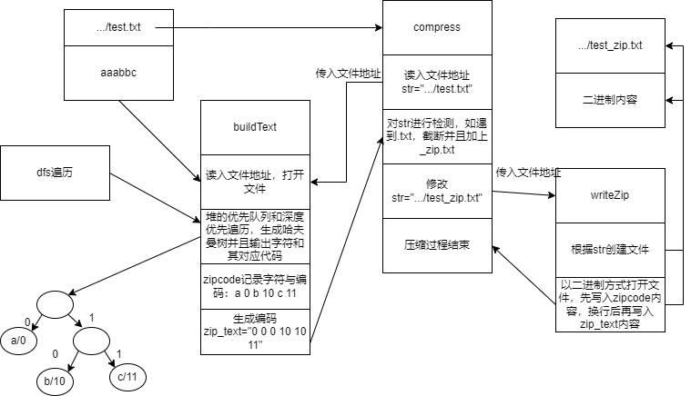
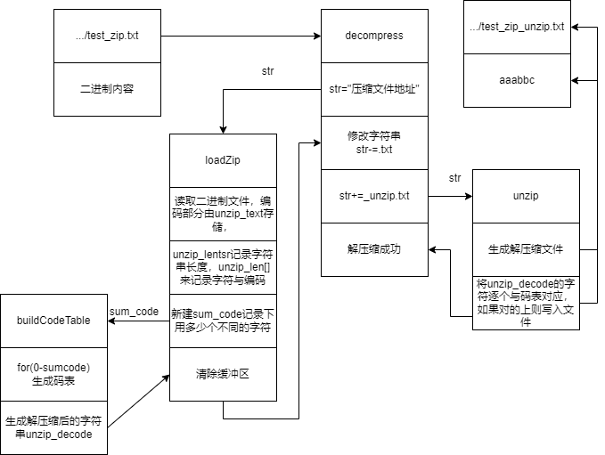
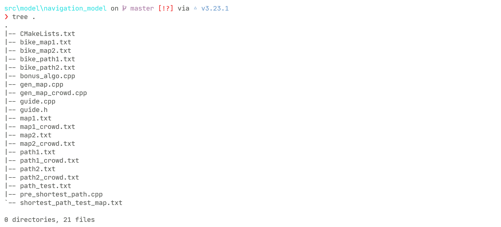
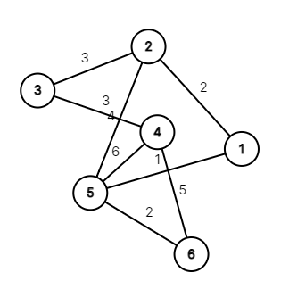

# 数据结构课程设计报告

- 周    宇 (2020211606)
- 任晓斌 (2020211592)
- 孟浩洋 (2020211591)

## 1. 项目背景概述

此项目为 2022 年春季北京邮电大学数据结构课程设计项目，背景为学校的课程辅助系统，可以帮助学生管理自己的课程和课外活动，具备课程导航功能、课程信息管理和查询功能，以及课外信息管理和查询功能等。每天晚上系统会提醒学生第二天上的课，每门课需要交的作业和需要带的资料，以及考试的信息。快要上课时系统根据该课程的上课地点设计一条最佳线路并输出。学生可以通过系统管理每门课的学习资料、作业和考试信息。在课外，学生可以管理自己的个人活动和集体活动信息，可以进行活动时间的冲突检测和闹钟提醒。

### 1.1. 项目结构概述

本项目使用终端进行交互的方式，通过命令行来进行信息的输入和输出，是一个在本地运行的单机版程序。

项目的文件目录树如下：

```
.
|-- CMakeLists.txt
|-- LICENSE
|-- README.md
|-- build
|   `-- cmake build files
|-- doc
|   |-- report.md
|   |-- course_model_report.md
|   `-- doc.md
|-- log
|   |-- stu
|   `-- stu.txt
`-- src
    |-- CMakeLists.txt
    |-- global_file.h
    |-- main.cpp
    `-- model
        |-- course_model
        |-- identity_model
        `-- navigation_model
```

- `src` 目录包含程序的所有源码, 主要为程序的所有模块。
- `log` 为程序的日志文件目录，包含所有程序运行日志文件。
- `doc` 为项目的文档目录，包含课程设计报告和程序文档。
- `build` 为使用 CMake 构建项目后生成的目录。

### 1.2. 编译构建以及运行

项目依赖：

- GNU tool chains for windows (mingw64)
- GCC version support >= C++14
- CMake version >= 3.21
- bash shell for build in terminal

编译构建项目：

- 使用 Cmake 在 bash 终端命令行构建：

```bash
rm -rf build/ && mkdir build && cd build && cmake -G "MinGW Makefiles" .. && cmake --build . -j 24 --target navigation && cd ../
```

- 进入 build 构建目录执行程序：

```bash
cd build/build/

./navigation.exe
```

注意如果使用 git bash 在 `build/build` 目录执行程序 `./navigation.exe` 无响应，请使用其他 shell 比如 powershell 来执行 `./navigation.exe`, 此 bug 为 git bash 在 Windows 平台的不兼容所导致。


## 2. 组员贡献
  周宇 (40%)：
- 编写课外信息管理的全部代码
- 编写除压缩和解压相关算法的课内信息管理的全部代码
- 编写系统时间模拟算法
- 编写 `admin_model` 和 `teacher_model` 中除了作业查重算法的全部代码
- 编写日志相关代码

 任晓斌 (40%)：

- 设计构建整个项目的初始框架, 包括登录注册菜单交互等功能
- 编写项目的构建系统 CMake 配置，设计各模块的依赖关系
- 编写导航模块的全部代码 (包括途径多个地点最短路的选作算法)
- 实现 Aho–Corasick Algorithm (AC自动机算法) 进行学生作业查重

 孟浩洋 (20%)：

- 实现哈夫曼压缩算法对文件内容进行压缩和解压
- 实现教师批改作业，学生提交作业，学生上传资料以及下载资料的功能
- 协助构建系统的各个基本模块，以及程序的单元测试


## 3. 模块和功能

整个项目按照不同的功能和需求主要划分为如下三个模块：

- 用户身份模块 `identity_model`，是整个项目的主要模块，包含所有用户相关逻辑的实现。
- 学生课程模块 `course_model`，包括所有学生课程相关逻辑和功能的实现。
- 学生导航模块 `navigation_model` ,包含所有学生在校内导航的功能需求实现。

接下来对每个模块进行详细的逻辑实现思路分析以及代码实现细节的讲述。

### 3.1. 用户身份模块 (identity_model)

#### 3.1.1. 学生部分 (stu_model)
##### 3.1.1.1. 数据结构说明和数据字典

 - 1.`map<string, string name_to_id`

   在找到正确的名字后通过名字找到对应的课程下标，通过下标可以读取课程文件创建课程类

- 2.`map<int, pair<string, string  time_to_place`

   在找到合理的时间（大于输入时间的最新上课开始时间）后必须通过时间查找到对应的地名（校区+建筑），这样学生可以实现通过时间进行导航
- 3.`string my_course_table[6][12]`

   存储学生课程表
- 4.`Node t1[1000],Node t2[1000]`

    分别是用来存储课程时间和活动时间的二叉搜索树
- 5.`map<string, vector<single_activity  name_to_activity`

    在找到正确的名字后通过名字找到对应的活动
- 6.`map<int, vector<single_activity  time_to_activity`

     在找到正确的时间后通过时间找到对应的活动
- 7.`struct single_activity`

    存储活动信息的单元
- 8.`weekly_sys_time`

     模拟时间，精确到秒
- 9.`weekly_real_time`

    真实时间，精确到毫秒，用于计算得到模拟时间
- 10.`map<word_to_sen,map<word_to_par>`

   字符到包含该字符的字符串的map
   这个`map`位于学生模块中，包含 `x` 项，用于模糊查找，`map`内部使用红黑树，在查找时通过对输入的 `k `个字符作为 `key`,查找对应的`value`,可以以  $ O(klog x) $  时间复杂度实现模糊查找。


##### 3.1.1.2. 实现的功能

- 1.课程名称模糊查询  
  
 -   2.课表课程查询    
     
 -  3.课程时间查询    
    
-   4.活动名称模糊查询    
    
 -   5.进入活动菜单（进入后可以对个人活动增删改，还可以对活动按照类别进行查找后按照时间排序)    
     
-    6.活动时间查询    
     
 -    7.进行路径导航 

 -  8.模拟时间暂停

 - 9.模拟时间快进
 - 10.活动闹钟提醒 (以模拟时间为准，通过输出`"\a"`模拟闹铃)
##### 3.1.1.3. 算法及分析
###### 3.1.1.3.1. 二叉搜索树
 场景：
- 对课程和活动时间进行查询时使用

 优缺点：

- 用户期望在输入一个时间后，能够得到这个时间之后离它最近的那个数据。通过二叉搜索树，这可以在`O(ln n)` 时间内实现。
- 用户在期望按照时间进行排序，而通过二叉搜索树不必建立新的数组进行排序，只需要进行一次遍历。
- 用户可能对活动进行大量的添加，树形结构可以保证结点的变化所导致的数据转移消耗较低。
- 在特殊情况下，二叉搜索树会失衡，性能将会逼近链表。

 分析：
- 二分查找复杂度分析:
  最坏情况：假设所要查找的数据在树中最后一层，那么查找次数`k`满足$2^k=n$,$k=logn$。
  最坏复杂度 = $O(log   n)$ 
- 假设数据量为n.
 程序中通过 `kth( rank( time+ 1) )` 来找到time的后继：
 ```cpp
 int Student::rank(int x, int root, Node *t) {
    if (root) {
        if (x < t[root].value)
            return rank(x, t[root].left, t);
        if (x > t[root].value)
            return rank(x, t[root].right, t) + t[t[root].left].size + t[root].num;
        return t[t[root].left].size + t[root].num;
    }
    return 1;
}

int Student::kth(int x, int root, Node *t) {
    if (x <= t[t[root].left].size) return kth(x, t[root].left, t);
    if (x <= t[t[root].left].size + t[root].num) return t[root].value;
    return kth(x - t[t[root].left].size - t[root].num, t[root].right, t);
}
 ```
  `rank(x+1)`通过分治查找返回x的后继的排名，`kth(y)`通过分治查找返回排名y的数据的值。两个二分查找复杂度均为 $ O(log n) $ ，则只需要 $O(log n)$ 复杂度即可得到结果。
- 通过`insert(x)`来添加结点，依然采用分治，则可以在 $O (log n) $ 时间内完成活动的添加
```cpp
void Student::insert(int x, int root, Node *t, int &cnt) {
    if (x < t[root].value)
        if (!t[root].left)
            t[t[root].left = ++cnt] = Node(0, 0, 1, x);
        else
            insert(x, t[root].left, t, cnt);
    else if (x > t[root].value)
        if (!t[root].right)
            t[t[root].right = ++cnt] = Node(0, 0, 1, x);
        else
            insert(x, t[root].right, t, cnt);
    else
        t[root].num++;
    update(root, t);
}
```
###### 3.1.1.3.2. 利用端点和中点坐标的冲突检测算法
  场景：
 - 在用户设置活动或者查看活动时，需要检测是否与课程存在冲突

  采用理由：
 - 代码简洁高效
```cpp
bool Student::interact(int x1, int x2, int y1, int y2) {
    return (x1 + y1 - x2 - y2 <= x1 + x2 - y1 - y2) && (x1 + x2 - y1 - y2 <= x2 + y2 - x1 - y1);
}
```
 分析：

 - 回忆中学判断两个圆的位置关系，关键在于把握半径和圆心距之间的数量关系。类比到线段，圆心距相当于中点距，直径相当于端点距离。


  ##### 3.1.1.4. 与其他模块交互

 - 1.可以通过课表查询或者课程名称查询创建course实例，完成学生所需要的与课程有关的功能 
 - 2.与活动相关的功能都在本模块内部实现
 - 3.通过路径导航功能可以创建guide实例，实现学生的导航需求
##### 3.1.1.5. 执行效果
- 课程名称查询


- 活动类型查询

  

- 学生设置活动

  

- 课程课表查询

  

- 活动名称查找

  

- 活动页面

    

 #### 3.1.2. 管理员用户
 ##### 3.1.2.1. 数据结构说明和数据字典
- 1.`struct single_course_a`

  一堂课，管理员在修改课程时需要将文件内容存储到该结构体中，在内存中对该结构体进行修改后再重新存入文件
- 2.`whole_course_a`

  一门课，管理员在发布课程时需要在内存中对该结构体的变量进行赋值后再新建相关文件
- 3.`single_activity_a`

  一次活动，管理员在修改班级活动时需要将班级活动文件内容存储到该结构体中，在内存中对该结构体进行修改后再重新存入文件

##### 3.1.2.2. 实现的功能
- 1.班级活动菜单（对班级活动进行增加和删除）

- 2.发布新的课程
- 3.修改原有课程
- 4.根据活动类型进行查找并且将结果按照时间排序

##### 3.1.2.3. 与其他模块交互
- 管理员对文件的修改将会影响到其他用户在之后读取各种数据的情况
##### 3.1.2.4. 执行效果
- 管理员修改考试时间


- 管理员发布班级活动


#### 3.1.3. 教师用户
##### 3.1.3.1. 数据结构说明和数据字典
- `map<string, string name_to_id`
  存储从文件中读到的课程名和id的映射，用户在输入课程名称后可以进入到课程文件中读取信息。 

##### 3.1.3.2. 实现的功能
- 发布作业
- 批改作业

##### 3.1.3.3. 与其它模块的交互
- 发布作业后选了该课程的所有学生在`homework_set`中会多出一份作业文件夹，学生可以在下一次进入该课程页面后发现老师布置了作业
- 批改作业后会把分数写入文件，学生可以在下一次进入该课程页面后看到老师给这次作业多少分
##### 3.1.3.4. 执行效果
- 教师布置作业


- 教师批改作业


### 3.2. 学生课程模块 (course_model)
#### 3.2.1. 数据结构说明和数据字典
  - 1.`struct single_course`

     存储一堂课的信息单元
  - 2.`struct material`

     存储一份电子资料的单元（包含权重信息）
- 3.`struct hw`

    存储一份作业的信息单元（包含成绩信息）
- 4.`vector<int order_hws`

    以成绩为关键字进行快速排序时，存放排序结果的下标
- 5.`vector<int order_materials`

     以权重为关键字进行快速排序时，存放排序结果的下标

#### 3.2.2. 实现的功能

 - 1.提交课程作业  

 -  2.提交课程资料                            
- 3.下载课程资料    
- 4.作业名称模糊查询   
 -   5.作业成绩排序    
 - 6.资料名称模糊查询   
  - 7.资料权重排序
#### 3.2.3. 算法及分析

##### 3.2.3.1. 通过下标的转换进行快速排序
 场景：
- 在进行资料按照权重进行排序，或者作业按照分数进行排序时

 优缺点：

- 原始数据完全无序，采用快速排序效率最高
- 考虑到单个作业结构体或者资料结构体所占空间较大，我们在排序时只移动保存在另一个数组中的下标，可以节约无用数据进行转移耗费的资源。

 分析：
 ```cpp
 void Course::qsort_m(int l, int r) {
    int i = l, j = r, flag = materials[order_materials[(l + r) / 2]].weight, tmp;
    do {
        while (materials[order_materials[i]].weight > flag) i++;
        while (materials[order_materials[j]].weight < flag) j--;
        if (i <= j) {
            tmp = order_materials[i];
            order_materials[i] = order_materials[j];
            order_materials[j] = tmp;
            i++;
            j--;
        }
    } while (i <= j);
    if (l < j) qsort_m(l, j);
    if (i < r) qsort_m(i, r);
}
 ```
- 考虑到最好情况，假设每次都是均匀划分，则运算成本为：
  $T(n) =2 - T(n/2) + n$
  递归展开后：
  $T(n) = 2 - 2[T(n/4) + n/2] + n = 2^kT(n/(2^k)) + kn$
  最后结束于T(1), 即：$2^k=n$
  可得：
  $T(n) = Cn + nlogn$
  不难看出复杂度为 $ O(nlogn) $ 。
##### 3.2.3.2. 压缩文件

场景：

- 学生提交作业和提交材料  

示意图：



算法实现：

- 哈夫曼树的结构为

```cpp
struct zipnode {
    int val;//保存字母的权值
    char ch;//保存字母
    zipnode -l, -r;//结点的左右孩子，初始时设置为空
    zipnode(int v, zipnode- lc = nullptr, zipnode- rc = nullptr) : val(v), l(lc), r(rc){};
};
struct cmp { //使用堆的优先排列生成树
    bool operator()(zipnode- a, zipnode- b) {
        return a->val > b->val;
    }
};
```

- 有关量定义

```cpp
unsigned int zip_lenstr;//记录文档的长度
zipnode- rt = nullptr;//初始化哈夫曼树
map<char, string> zip_code;//记录哈夫曼树生成的字符与对应的编码
string zip_text;//压缩后的文件编码以字符串的形式保存
```

- 在处理需要压缩的文件时，采用二进制方式读取文件

  ```cpp
  in.open(pathname, ios::binary);
  ```

- 采取堆的优先队列生成哈夫曼树,时间复杂度为$O(nlog(n))$同时输出字母及其ASCII码对应的数值，以及字母对应的编码

  ```cpp
  priority_queue<zipnode-, vector<zipnode->, cmp> Q;
  for (auto x : cnt) {
          zipnode- p = new zipnode(x.second);
          p->ch = x.first;
          Q.push(p);
      }
  while (Q.size() >= 2) {
          zipnode- lc = Q.top();
          Q.pop();
          zipnode- rc = Q.top();
          Q.pop();
          rt = new zipnode(lc->val + rc->val, lc, rc);
          Q.push(rt);
      }
  dfs(rt, "");//哈夫曼树的优先遍历
  for (auto x : zip_code) {
          if (isprint(x.first)) cout << x.first;
          cout << "/" << (int)x.first << " : " << x.second << endl;
      }
  ```

- 对哈夫曼树进行深度优先遍历，时间复杂度为$O(n)$, `dfs ` 函数如下

```cpp
void dfs(zipnode- p, string s) {
    if (p->l == nullptr && p->r == nullptr) {
        zip_code[p->ch] = s;
        return;
    }
    if (p->l != nullptr) dfs(p->l, s + '0');
    if (p->r != nullptr) dfs(p->r, s + '1');
}
```

- `compress`的逻辑如下。`str`是输入的作业地址，由学生输入作业次数等信息后自动生成，`buildText`函数用于生成哈夫曼树以及对原文件进行二进制读入，`writeZip`函数将编码以及哈夫曼树的信息写入新生成的压缩文件中。

```cpp
void compress(string str) {
    cout << "compress启动成功" << endl;
    buildText(str.c_str());
    int pos = str.find_last_of('.');
    string str1 = str.substr(0, pos);
    str = str1 + "_zip.txt";//将新生成的文件命名为XXX_zip.txt
    writeZip(str.c_str());
}
```

优点：

-  由于压缩的文件不需要被看到,而二进制文件储存相对来说占空间小。于是参考了对二进制文件的处理方式，选择用二进制文件存储压缩后的信息，简单高效。


##### 3.2.3.3. 解压缩文件

场景：

- 学生下载资料，老师批改作业

示意图：



算法实现：

- 有关量定义

```cpp
    unsigned int unzip_lenstr; //记录哈夫曼码的长度
    pair<char, int> unzip_chlen[257];//存放生成的码表，包括字符和权值，最多存放257对信息
    map<char, string> unzip_code;//辅助生成unzip_decode
    map<string, char> unzip_decode;//存放解压缩后的字符信息
    string unzip_text; //存放解压缩后的字符串
```

- `decompress`逻辑如下，`str`存放的是需要解压缩的文件地址，` loadZip	`函数读入压缩后的文件，生成码表，并且解压缩；`unzip`函数将解压缩后的内容存放在_zip_unzip.txt文件中。

```cpp
void decompress() {
    string str;
    cin >> str;
    loadZip(str.c_str());
    int pos = str.find_last_of('.');
    string str1 = str.substr(0, pos);
    str1 += "_unzip.txt";//命名压缩后的文件。由于是压缩后再解压缩的，因此名字后缀改成_zip_unzip.txt
    unzip(str1.c_str());
}
```

- 函数`buildCodeTable`作用是将压缩文件中的如何解压缩的信息读入并且生成码表，由函数`loadZip`调用。程序可以自行生成码表并解码，不需要手动输入，方便操作。

```cpp
void buildCodeTable(int n) {//建立编码列表函数 
	int now = 1;
	for (int i = 0; i < n; ++i) {
		char now_char = unzip_chlen[now].first;
		unzip_code[now_char] += unzip_text[i];
		if (unzip_code[now_char].length() == unzip_chlen[now].second) {
			unzip_decode[unzip_code[now_char]] = now_char; //生成解压缩字符串
			now++;
		}
	}
}
```

* 函数`unzip`在写入文件的过程中，将`unzip_decode`的字符再次比对，确保正确再写入，相当于一个二次检查,时间复杂度为 $O(n)$ 。

```cpp
void unzip(const char* pathname) {//保存 
	ofstream out;
	out.open(pathname, ios::binary);
	string now;
	for (int i = 0; i < unzip_lenstr; ++i) {
		now += unzip_text[i];
		if (unzip_decode.count(now)) {
			out.put(unzip_decode[now]);
			now.clear();
		}
	}
}
```


优缺点：

- 解码信息存储在文件中，不必手工输入，操作简单。
- 由于和其他函数交互的原因，一次解压后再次解压会出现乱码。
#### 3.2.4. 与其他模块交互
- 学生用户可以在个人主页中通过课程表选定课程或者通过搜索来创建课程类实例并进入课程界面实现课程提供的各种功能
#### 3.2.5. 执行效果
- 提交课程资料


- 资料权重排序

  

- 作业名称查询

  

  

- 压缩解压测试
  
  


### 3.3. 校园导航模块

_此模块代码实现和报告/文档撰写由（2020211592 任晓斌）实现_

#### 3.3.1 需求实现概述

校园导航模块实现了所有课程设计中需求的功能，学生可根据多种方式进行导航，方式如下:

- 学生根据课程名称导航
- 学生根据上课时间导航
- 学生根据上课地点导航

同时学生导航可以有多种导航策略，而且考虑了跨校区等细节情况，方式如下:

- 最短距离策略导航
- 最短时间策略导航（考虑道路的拥挤度）
- 交通工具的最短时间策略（考虑不同的交通工具方式）

- 实现跨校区导航，自动识别是否需要跨校区进行路径规划

具体每个功能的实现细节，以及代码细节分析，文档后续会详细说明。

#### 3.3.2. 核心算法概述

在各种不同策略和要求的最短路实现代码中，均采用 [Floyd 算法](https://en.wikipedia.org/wiki/Floyd%E2%80%93Warshall_algorithm)来预处理出全源最短路，且以文件保存所有预处理好的最短路结果，每次导航只需快速查询即可，不用每次导航都跑一次最短路算法。

为什么采用预预处理全源最短路，而不是每次导航都跑一次 Dijkstra 或者其它单源最短路算法呢？我们先分析一下每次导航都要跑 Dijkstra 算法的时间和空间复杂度。朴素实现的 Dijkstra 算法时间复杂度为 $O(mn)$, 其中 $m$ 为图中的边数，$n$ 为图中的点数。考虑每次导航时如果在线建图一次，其 I/O 所用时间已经是近似 $O(n^2)$ 时间复杂度, 且导航在系统中是较为常用的部分，需要频繁调用。

所以综上考虑，使用 Floyd 算法只需要一次预处理以 $O(n^3)$ 的时间花费即可求出整个地图的全源最短路，因为地图在后续的系统运行中是不会再被修改的，所以我们将预处理出的结果保存下来查询即可。

#### 3.3.3. 需求实现代码细节分析

接下来对导航模块中所有项目需求详细讲述源代码，实现思路，以及执行效果。在地图中，我们约定保留 $1$ 号建筑物为校门, 所有建筑设施的编号均在 $1 \sim 20$ 内, 所有课程导航**只按照在课表中有课的建筑**之间进行路径导航。

导航模块源码目录树:



- `guide.cpp` 为导航主要的代码，除了选做算法之外所有的导航功能均在此文件源码实现。
- `*map.txt` 文本文件均为静态生成的地图，使用所有 `gen_map*.cpp` 程序生成各种需求地图。
- `bonus_algo.cpp` 为此项目的选做算法，规划出经过固定点的最短路径。
- `*path.txt` 为提前使用最短路算法处理好的最短路径，输出路径时直接查询即可。

课表文件位于项目 `src/model/identity_model/course_table` 目录下，下面以学生 $2020211591$ 的课表为例进行导航的所有功能测试和分析。

首先运行程序，以账号 $2020211591$ ，密码 $123$ 登录进入系统:


然后在学生菜单中选择选项 $7$ "进行路径导航"，键入回车后即可进行各种导航功能测试。


##### 3.3.3.1. 根据课程名称导航

在这个需求中，学生输入需要查询的上课名称，然后系统即可规划同时输出最短路策略。

首先来看程序的演示执行效果，在导航菜单中键入 $1$ 进行根据课程名称导航:


回车之后，系统首先会检索当前学生 $2020211591$ 的课表，全部列出该学生本学期的课程，如下:


比如我们输入当前正在上的课程《计网》，然后 输入接下来要上的课程《毛概》，键入回车之后，系统首先会自动识别是否需要跨校区上课，然后再输出导航规划的路径，对于这两门课，根据上面说的课表文件可知，是不需要跨校区的，都在沙河校区上课，所以输出结果如下：


导航会同时输出所有情况和策略下的最短路规划方案，供学生选择，比如最短步行距离策略，最短步行时间策略，以及通过骑自行车的交通方式，走自行车道的路线和所需时间。

然后再测试一个需要跨校区上课的例子，比如输入当前正在上的课程为《毛概》，接下来要上的课程为《Java》，输出结果如下：


此时系统会同时加上跨校区导航，也就是从沙河校区至西土城校区，或者从西土城校区至沙河校区的导航规划。

同时提供定点班车路线: 北邮沙河校区->沙河公交站->马甸桥东公交站->蓟门桥南公交站->北邮海淀校区

校车途径路线: 北邮沙河校区->沙河公交站->京藏高速沙河收费站->京藏高速->马甸桥->北邮海淀校区

同样地，选择当在西土城校区上课，然后接下来要上的课输入一门沙河校区的，会以同样的逻辑进行导航，这里就不再赘述。以上就是以课程名称导航的执行效果，接下来分析这部分实现的代码和思路。

- `Guide` 导航类的声明, 源码位于当前模块目录下的 `guide.h`

```cpp
class Guide {
   public:
    int build_now;      //现在所处的建筑位置
    string campus_now;  //现在所处的校区 沙河 西土城
    string stu_id;      //当前操作的学生的学号

    Guide();
    Guide(string in_campus, string stu_id);  //现在所处的校区 当前操作学生的学号
    Guide(string stu_id);                    //当前操作学生的学号

    void build_graph(string campus_now);  //每次导航时候都要先建图 放入内存中

    void guideOperMenu();                 //导航选择菜单
    void print_path_by_course();          //根据课程名称导航
    void print_path_by_location();        //根据上课地点导航 考虑不同校区
    void print_path_by_time();            //根据上课时间导航
    void print_path_by_fixed_building();  //选做算法 经过固定建筑(同校区内的建筑)
};
```

这里声明了所有导航模块中的函数，功能由其后的注释说明，这一部分先讲述根据课程名称导航的函数细节。

- `void Guide::print_path_by_course()` 根据课程名称导航

在函数开始，我们先读入需要的数据，比如学生的课表信息，课表里面包含了每门课的名称，上课地点，建筑的编号等等，我们分别使用哈希表 `std::map` 来映射存储，这样每次查询都可以 $O(logN)$ 复杂度快速查询信息。

```cpp
//课程表信息
//存入课程对应的建筑编号
map<string, int> mp;
map<string, string> campus_map;  //课程 课程所在校区
set<string> all_course;
//星期 第几节 教室 课程名称 所在校区 课程编号 教室所在建筑
string file_date, file_classroom, file_course_name, file_campus;
int file_class_number, name_length;
string file_course_id, garbage;
int file_building_id;
while (ifs >> file_date >> file_class_number >> file_classroom >> file_course_name >> file_campus >> file_course_id >> file_building_id >> name_length) {
    for (int z = 1; z <= name_length; z++) {
        ifs >> garbage;
    }
    mp[file_course_name] = file_building_id;
    campus_map[file_course_name] = file_campus;  //所在校区
    all_course.insert(file_course_name);
}
```

存储信息的核心代码如上，使用哈希表 `map<string, int> mp` 以及 `map<string, string> campus_map` 分别存储课程名称对应的建筑编号，以及课程名称对应的校区之间的映射关系。

接下来就是学生用户输入当前正在上课的名称，以及接下来要上课的名称，由于课程名称和其所在的建筑编号都已经保存在哈希表中，所以此时可以快速查询出这两门课所在的建筑编号，这样就可以查询已经求出的最短路径，然后输出就行了，代码如下：

- 首先根据校区关键字判断是否需要跨校区导航

```cpp
cout << "\n请输入您正在上的课程名称: ";
string course_go_on;
cin >> course_go_on;

cout << "请输入您将要上课的课程名称: ";
string course_name;
cin >> course_name;

bool flag_shahe_xitu = false;  //沙河->西土城 跨校区
bool flag_xitu_shahe = false;  //西土城 -> 沙河 跨校区
string cps_now = campus_map[course_go_on];
string cps_next = campus_map[course_name];
if (cps_now == cps_next && cps_now == "沙河") {
    cout << "\n已查询到您不需要跨校区上课, 当前为沙河校区内导航: \n";
    this->campus_now = "沙河";
} else if (cps_now == cps_next && cps_now == "西土城") {
    cout << "\n已查询到您不需要跨校区上课, 当前为西土城校区内导航: \n";
    this->campus_now = "西土城";
} else if (cps_now == "沙河" && cps_next == "西土城") {
    flag_shahe_xitu = true;
    this->campus_now = "西土城";
    cout << "\n已查询到您需跨校区上课, 将从沙河校区出发前往西土城校区: \n";

    // cout << "已到达西土城\n\n";
} else if (cps_now == "西土城" && cps_next == "沙河") {
    flag_xitu_shahe = true;
    this->campus_now = "沙河";
    cout << "\n已查询到您需跨校区上课, 将从西土城校区出发前往沙河校区: \n";

    // cout << "已到达沙河\n\n";
}
```

- 读取地图数据文件，然后找到建筑编号

```cpp
int now_build_id = mp[course_go_on];  //当前所在校区的建筑
int next_build_id = mp[course_name];  //目的校区所在建筑

ifstream iifs;
string path_file;

if (this->campus_now == "沙河")
    path_file = "../../src/model/navigation_model/path1.txt";  //沙河校区
else
    path_file = "../../src/model/navigation_model/path2.txt";  //西土城
```

接下来就是输出不同的导航策略下的路径规划方案，由于最短路径我们是已经预处理好的，所以只需要读取对应导航策略的路径数据文件然后输出方案即可，比如走自行车道的最短路方案在文件 `*bike_path.txt` 中。

- 最短距离策略

没有任何限制，没有拥挤度的最短距离路径预处理保存在文件 `path1.txt`(沙河校区)，以及 `path2`(西土城校区)

```cpp
for (std::string line; std::getline(iifs, line);) {
    vector<string> v;  //去掉空格分开之后的所有单独建筑编号
    string temp = "";

    for (int i = 0; line[i]; i++) {
        if (!isspace(line[i]))
            temp += line[i];
        else {
            while (isspace(line[i])) i++;
            i--;
            v.push_back(temp);
            temp = "";
        }
    }
    v.push_back(temp);

    if (stoi(v[0]) == now_build_id && stoi(v[1]) == next_build_id) {
        // cout << line << endl;
        for (int i = 2; i < (int)(v.size() - 2); i++) 
            cout << (v[i] == "1" ? (cps_next + "校门 -> ") : v[i] + " 号教学楼 -> ");
        cout << v[v.size() - 2] + " 号教学楼" << endl;
        cout << "----------------------------------------------------------\n";
        cout << "最短步行路线总长度: " << v[v.size() - 1] << " 米" << endl;
        break;
    }
}
```

输出规划路径的代码如上所示，本质逻辑就是线性复杂度 $O(n)$ 遍历最短路方案，然后输出即可。

- 最短时间策略

在最短时间策略中，我们对地图道路附加上拥挤度属性，此部分导航按照课设要求不考虑跨校区。道路的拥挤度采用随机数赋予，道路拥挤程度程度使用整数范围在 $[1,3]$ 内表示，生成具有拥挤度的源码位于 `gen_map_crowd.cpp`, 生成地图的核心代码如下:

```cpp
void gen() {
    std::random_device seed;
    std::mt19937 rand(seed());
    std::uniform_int_distribution<int> dist(0, 999); //距离，单位为米，随机距离 [1,1000]
    std::uniform_int_distribution<int> building_id(0, 19);  //建筑编号 [1,20]
    std::uniform_int_distribution<int> crowdedness(0, 2);  //道路拥挤程度 [1,3]

    ofstream ofs;
    ofs.open("map2_crowd.txt");

    //选210条边
    //建筑距离>50m的才符合实际
    int cnt = 0;
    while (1) {
        int build1 = building_id(rand) + 1;
        int build2 = building_id(rand) + 1;
        int random_dist = (dist(rand) + 1) * (crowdedness(rand) + 1); //距离*拥挤度
        if (random_dist < 50) continue;
        if (build1 == build2) continue;  //排除自环的情况
        cnt++;
        ofs << build1 << ' ' << build2 << ' ' << random_dist << endl;
        if (cnt >= 210) break;
    }
    ofs.close();
}
```

根据上述有拥挤度的地图，预处理最短路方案的文件为 `path*_crowd.txt` 所以在查询最短路方案时查询这些文件 。输出最短时间方案的核心代码如下:

```cpp
//最短时间策略，重新生成地图考虑拥挤度 不考虑跨校区 步行不考虑交通方式
//输出步行时间 步速 1.5m/s

string crowd_path_file;
if (this->campus_now == "沙河")
    crowd_path_file = "../../src/model/navigation_model/path1_crowd.txt";  //沙河校区
else
    crowd_path_file = "../../src/model/navigation_model/path2_crowd.txt";

ifstream ifs_crowd;
ifs_crowd.open(crowd_path_file, ios::in);
if (!ifs_crowd.is_open()) {
    cout << "拥挤度路径寻找文件不存在!" << endl;
    system("pause");
    return;
}

cout << "最短步行时间路线如下: \n";
cout << "------------------------------------------------\n";
for (std::string line; std::getline(ifs_crowd, line);) {
    vector<string> v;  //去掉空格分开之后的所有单独建筑编号
    string temp = "";

    for (int i = 0; line[i]; i++) {
        if (!isspace(line[i]))
            temp += line[i];
        else {
            while (isspace(line[i])) i++;
            i--;
            v.push_back(temp);
            temp = "";
        }
    }
    v.push_back(temp);

    if (stoi(v[0]) == now_build_id && stoi(v[1]) == next_build_id) {
        // cout << line << endl;
        for (int i = 2; i < (int)(v.size() - 2); i++) cout << (v[i] == "1" ? (cps_next + "校门 -> ") : v[i] + " 号教学楼 -> ");
        cout << v[v.size() - 2] + " 号教学楼" << endl;
        cout << "------------------------------------------------\n";
        cout << "最少步行所需时长约 " << 
            stoi(v[v.size() - 1]) * 1.0 / 1.5 << " 秒" << endl;
        break;
    }
}
```

- 交通工具策略导航

此导航策略要求校区内选择自行车时，只能走自行车道路，默认自行车在校区任何地点都有；在考虑不同拥挤度的情况下时间最短；对应的地图文件位于 `bike_map*.txt` ，预处理求出的最短路方案位于文件 `bike_path*.txt` 中，输出走自行车道的导航方案核心代码如下:

```cpp
//交通工具策略 考虑新地图 自行车道 考虑拥挤度
//自行车道重新生成地图
//只需要最短时间，行驶速度为 4m/s
//自行车道地图 bike_map1.txt bike_map2.txt bike_path1.txt bike_path2.txt
string bike_path_file;
if (this->campus_now == "沙河")
    bike_path_file = "../../src/model/navigation_model/bike_path1.txt";  //沙河校区
else
    bike_path_file = "../../src/model/navigation_model/bike_path2.txt";

ifstream ifs_bike;
ifs_bike.open(bike_path_file, ios::in);
if (!ifs_bike.is_open()) {
    cout << "自行车道路径寻找文件不存在!" << endl;
    system("pause");
    return;
}

cout << "自行车道最短时间路线如下: \n";
cout << "-------------------------------------------------------\n";
for (std::string line; std::getline(ifs_bike, line);) {
    vector<string> v;  //去掉空格分开之后的所有单独建筑编号
    string temp = "";

    for (int i = 0; line[i]; i++) {
        if (!isspace(line[i]))
            temp += line[i];
        else {
            while (isspace(line[i])) i++;
            i--;
            v.push_back(temp);
            temp = "";
        }
    }
    v.push_back(temp);

    if (stoi(v[0]) == now_build_id && stoi(v[1]) == next_build_id) {
        // cout << line << endl;
        for (int i = 2; i < (int)(v.size() - 2); i++) 
            cout << (v[i] == "1" ? (cps_next + "校门 -> ") : v[i] + " 号教学楼 -> ");
        cout << v[v.size() - 2] + " 号教学楼" << endl;
        cout << "-------------------------------------------------\n";
        cout << "最少骑车所需时长约 " << 
            stoi(v[v.size() - 1]) * 1.0 / 4.0 << " 秒" << endl;
        break;
    }
}
```

以上就是学生用户根据课程名称关键字进行导航，其核心代码逻辑的分析和说明。


##### 3.3.3.2. 根据上课地点导航

在此功能需求中，学生需要输入上课的地点，系统为学生输出路径规划方案。

- 上课地点是上课的物理位置（例如 沙河 2号楼208）

- 起点和终点可以在不同校区，需要考虑校区间的交通方式；

- 校区间的交通方式为：定点班车（可以自行规划班次时刻表）和公共汽车（可等间隔发车）。

首先是程序执行的演示效果如下，和根据课程名称导航一样，系统会自动识别是否需要跨校区进行导航，如果不需要跨校区就输出在本校区内的导航，我们就以一个比较复杂的跨校区例子来演示, 同样来到导航选择菜单：


我们输入操作选项 $2$ 进行根据上课地点来导航，然后接着输入当前所在的上课地点，以及接下来所要去的上课地点。在图示的测试样例中，我们输入当前位于沙河校区 2 号楼 208，将要抵达西土城校区 8 号楼 104 进行上课。

导航自动识别到需要跨校区，先输出校区间的导航路径，包括校车以及定点班车的方案。

然后分别输出所有导航策略，包括最短路径，最短时间，不同交通方式策略下的最短路径规划方案:


接下来我们讲述此功能实现的代码细节，同样的，和根据课程名称导航的函数类似，我们先读取学生课程表信息，然后使用哈希表分别存储上课教室和其所在对应的建筑编号，以及上课教室和其所在上课的校区之间的映射关系 ，这样对于 C++ 中的 `std::map` 我们每次都可以高效 $O(logN)$ 时间复杂度查询到建筑编号，进行导航。

```cpp
//课程表信息
//存入课程对应的建筑编号
map<string, int> mp;  //具体教室 教室所在建筑编号
// map<string, string> campus_map;  //具体教室 教室所在校区
set<string> all_course;
//星期 第几节 教室 课程名称 所在校区 课程编号 教室所在建筑
string file_date, file_classroom, file_course_name, file_campus;
int file_class_number, name_length;
string file_course_id, garbage;
int file_building_id;
while (ifs >> file_date >> file_class_number >> file_classroom >> file_course_name >> file_campus >> file_course_id >> file_building_id >> name_length) {
    for (int z = 1; z <= name_length; z++) {
        ifs >> garbage;
    }
    mp[file_classroom] = file_building_id;
    // campus_map[file_course_name] = file_campus;  //所在校区
    all_course.insert(file_course_name);
}
```

这部分代码其实也是和上面根据课程名称导航部分唯一不同地方，我们使用哈希表维护的查询信息不同，一个是根据课程名称，此处是根据上课地点。其余的代码均完全复用即可，因为导航最本质的逻辑都是要归到建筑的编号上，不论根据什么导航，我们先想办法找到目的的建筑编号，然后其余的代码逻辑完全照搬复用即可，此功能后续实现部分完全参考上面根据课程名称导航的讲述，以及源码的注释即可。

还有就是需要注意一点，对于课表中没有课的建筑，导航系统是读取不到建筑信息的，所以也就无法输出路线，在测试样例中**请务必根据学生课表信息的课程进行导航，请勿随意输入建筑设施的编号**。


##### 3.3.3.3. 根据上课时间导航

在此功能需求中，需要学生输入打算上课的时间，然后系统为学生查询距离此时间最近的课程。如果当天已无课程，会提示学生输入改天的时间。

上课时间可以是 “周五10点30分（Fri 10:30) ” 系统会自动更据学生的班级信息和最近的上课时间（未开始）查询上课地点。

首先是程序执行的演示效果如下，和根据课程名称导航一样，系统会自动识别是否需要跨校区进行导航，如果不需要跨校区就输出在本校区内的导航，我们就以一个比较复杂的跨校区例子来演示, 同样来到导航选择菜单：


学生用户先输入当前所在校区以及当前所在的建筑编号，方便导航系统定位。然后学生需要输入自己打算上课的时间，比如周五早上 10:30 分，此处注意输入格式，使用英文星期，随后系统便开始导航规划路径输出如下:


导航效果如上图所示，系统首先会根据学生用户输入的上课时间，为学生查询到最近还未开始上的课程，包括这门课的校区（上图显示为西土城），这门课在目的校区所在的建筑编号（上图显示为西土城校区 3号楼），以及这门课的名称（上图显示为 PHP 语言基础）。接下来会根据是否需要跨校区导航，分别输出所有导航策略，包括最短路径，最短时间，不同交通方式策略下的最短路径规划方案。

接下来我们讲述这部分代码实现的细节和逻辑。学生课表的作息时间完全使用北邮计算机学院大二下学期的课表作息，这里使用我自己的课表作息时间来模拟系统时间，如下图所示：


系统首先根据学生输入的时间，来查找最近未开始上的课，如果当天已无课程，会提示学生输入改天的时间。对于世界的查找，代码具体实现的逻辑就是很简单的判断输入的时间落入哪个课程时间段:

```cpp
int class_number;
if (query_hour < 8)    //小于第一节课的时间
    class_number = 1;  //每天的第一节课
else if (query_hour <= 8) {
    if (query_minute == 0)
        class_number = 1;
    else if (query_minute <= 50)
        class_number = 2;
    else
        class_number = 3;
    else ...
}
...
```

变量 `class_number` 存储根据学生输入的时间 ，查询得到的课程节号，以便于进一步查找更多上课的信息，比如课程所在的校区，课程所在的建筑编号，等等。

在这个需求中，我们需要使用哈希表维护的映射关系就更麻烦一些。因为需要维护的信息有：

- 课程所在星期及课程节号
- 课程名称及其对应所在建筑编号
- 课程名称及其对应所在的校区

所以需要在哈希表中维护更多信息，我们使用如下代码来实现初始数据的存储映射关系:

```cpp
map<pair<string, int>, pair<string, int> > mp;  //<{Mon, 1}, {计网,5}> 星期 课程节号 课程名称 建筑编号
map<string, string> campus_map;                 //课程 课程所在校区
set<string> all_course;
//星期 第几节 教室 课程名称 所在校区 课程编号 教室所在建筑
string file_date, file_classroom, file_course_name, file_campus;
int file_class_number, name_length;
string file_course_id, garbage;
int file_building_id;
while (ifs >> file_date >> file_class_number >> file_classroom >> file_course_name >> file_campus >> file_course_id >> file_building_id >> name_length) {
    for (int z = 1; z <= name_length; z++) {
        ifs >> garbage;
    }
    mp[{file_date, file_class_number}] = {file_course_name, file_building_id};
    campus_map[file_course_name] = file_campus;  //所在校区
    all_course.insert(file_course_name);
}
```

哈希表 `mp` 内嵌两个 C++ `std::pair` 来同时维护课程日期，课程节号，课程名称，以及上课所在建筑编号，哈希表 `campus_map` 映射课程名称以及课程所在的校区。

上面已经说过了，如何维护课程信息之间的映射关系是不同条件导航实现思路的唯一区别，最后只需要转换为查询建筑编号就行了，所以后面的代码，完全复用根据课程名称导航，或者根据课程地点导航部分。


##### 3.3.3.4. 途径多个地点导航（选做算法部分）

在此功能需求中，需要实现通过学生用户指定必须经过的建筑编号来规划从起点到终点的最短路。

此算法实现源代码位于导航模块目录下的 `bonus_algo.cpp` , 我们通过证明算法的正确性，分析算法的复杂度，最后再讲解源码的过程来依次讲述这部分实现的内容。

1. 算法思路概述：

首先将问题抽象为这样的图论问题: 给定一个无向无负权图 $G(V,E)$, 规定起点 $S$, 终点 $T$, 且给定 $K$ 个图中互不相同的点 $a_1, a_2, a_3....a_k$ , 求出从 $S$ 出发到 $T$ ，同时经过所有点 $a_i(i=1 \sim k)$ 的一条最短路。

初步分析此问题的最坏情况，即在 $G$ 上求一条最短路，从 $S$ 出发到 $T$ 且必须经过所有点。此问题即为经典的 [Hamiltonian path problem](https://en.wikipedia.org/wiki/Hamiltonian_path_problem), 在 TCS 学术界早已证明为  NP-complete 问题，目前无多项式时间复杂度解法。所以此问题最坏情况可归约至 NP 完全问题，下面考虑一般情况下的此问题。

对于只求出经过有限数量固定点的情况，将图 $G$ 分割为两个点集 $G_1, G_2$, 令 $G_1 = \{V_1|V_1 ∈ a_i(i = 1 \sim k)\}$, $G_2 = G \backslash G_1$, 定义最短路 $Path(S,T,K)$ 表示在此问题约束下的最短路状态空间。定义图 $G$ 子集 $G_s$ 的排列 $P(G_s) = \{permutation(g_1, g_2, g_3...g_k) | g_1, g_2, g_3...g_k ∈ G_s \}$ , 则最短路最优解的状态空间：
$$
Path(S,T,K) = min\{Path(S,g_1^{\prime}, K) + \sum_{i=2}^{k-1} Path(g_i,g_{i+1}^{\prime},K) + Path(g_k^{\prime}, T, K), k \geq 2 \}
$$
其中 $\{g_1^{\prime}, g_2^{\prime}, g_3^{\prime}...g_k^{\prime} ∈ P(G_1) \}$ 表示约束点集子图的一个排列, $Path(S,T,K)$ 为求得最优解的状态集合。

2. 算法正确性证明：

假设 $Path(S,T,K^{\prime})$ 同为此问题的最优解空间, 讨论约束集合 $K$ 与 $K^{\prime}$ 的关系:

- $K^{\prime} \subset K$， 由 $min\{Path(S,T,K)\} = min\{Path(S,T,K^{\prime})\}$ 可知 $K^{\prime} = K$ 即最优解唯一，为 $min\{Path(S,T,K)\}$

- $K^{\prime} \not\subset K$ 且 $K^{\prime} \cap K \neq \emptyset$, 令 $K^{\prime\prime} = K^{\prime} \cap K$, 则存在子图 $G_{K^{\prime\prime}}$ 的一个排列 $P(G_{K^{\prime\prime}}) \not\in P(G_1)$, 这与所有的约束条件 $P(G_k) \in P(G_1)$ 矛盾, 所以 $K^{\prime} \not\subset K$ 且 $K^{\prime} \cap K \neq \emptyset$ 不成立.


- $K^{\prime} \cap K = \emptyset$, 同第二种集合关系，推导可知与所有的约束条件 $P(G_k) \in P(G_1)$ 矛盾，不成立.

- $K \subset K^{\prime}$, 同第一种集合关系. 由条件 $min\{Path(S,T,K)\} = min\{Path(S,T,K^{\prime})\}$ 可知 $K^{\prime} = K$ 即最优解唯一，为 $min\{Path(S,T,K)\}$

综上推导可知此最短路问题的唯一最优解状态空间为 $min\{Path(S,T,K)\}$ 不存在其它的最优解情况. QED.

3. 算法复杂度分析：

根据问题最优解的状态转移表达式来逐项分析:

$$
Path(S,T,K) = min\{Path(S,g_1^{\prime}, K) + \sum_{i=2}^{k-1} Path(g_i,g_{i+1}^{\prime},K) + Path(g_k^{\prime}, T, K), k \geq 2 \}
$$

对于求解 $\sum_{i=2}^{k-1} Path(g_i,g_{i+1}^{\prime},K)$, 需要 $O(K!)$ 时间复杂度，$K$ 为约束集合大小，也就是图中必须经过的点数集合大小。对于上式整体的求和结果，必须考虑到排列 $P(G_1)$ 的所有排列情况，通俗来讲为 $g_1^{\prime}$ 以及 $g_k^{\prime}$ 的所有情况都需要考虑，同时不断更新最优解。仔细思考一下，这本质上就是要求任意两点之间的最短路，那么可用的算法通常来说有 Floyd 算法求解全源最短路，或者对于每个点都执行一次 Dijkstra 算法，但是后者实现起来较为麻烦，相比 Floyd 算法复杂度只有常数级别的优化，故此处采用 Floyd 算法来实现。	

所以算法最终的复杂度为 $O(N^3 + K!)$, 其中 $N = |V|$, $K = |G_1|$ .

4. 算法代码实现和样例解释:

由于项目的地图中有超过20个建筑设施，所以不便于使用校园地图来举例讲述。为了直观演示算法的正确性和效果，我们此处构建一个较小的样例来说明，此测试样例对应的地图文件位于导航模块下的 `shortest_path_test_map.txt`, 我们首先绘制此样例对应的无向带权图如下所示: 



<center style="color:#C0C0C0;text-decoration:underline">使用   csacademy.com/app/graph_editor 绘制</center>

考虑从 $1$ 号点出发，终点为 $6$ 号点, 途中必须经过 $2,3,4,5$ 号点的测试样例。算法在开始执行前先使用 Floyd 算法预处理一次全源最短路，并记忆化保存，此样例中 $G_1 = \{2,3,4,5\}$, $|G_1| = 4$. 令 $P(G_1) = \{a_1, a_2...a_k\}$, 则对于 $P(G_1)$ 的每种排列，都求一次 $\sum_{i=2}^{k-1} Path(g_i,g_{i+1},K)$, 再加上 $Path(S,a_1, K) + Path(a_k, T, K)$ 的值来持续更新最优解即可，用伪代码描述如下：

```python
//Precomputation: Find all pairs shortest paths, e.g. using Floyd-Warshall
n = number of nodes
for i=1 to n: for j=1 to n: d[i][j]=INF
for k=1 to n:
    for i=1 to n:
        for j=1 to n:
            d[i][j] = min(d[i][j], d[i][k] + d[k][j])

//Now try all permutations
shortest = INF
for each permutation a[1],a[2],...a[k] of the 'mustpass' nodes:
    shortest = min(shortest, d['start'][a[1]]+d[a[1]][a[2]]+...+d[a[k]]['end'])
print shortest
```
接下来为此功能的演示效果：

首先进入导航菜单，键入选项 $4$ 选择经过固定点的导航，然后回车：


首先输入当前所在校区，便于系统定位。接着输入当前所在建筑，以及目的所在建筑的编号，最后输入必须经过的建筑：先输入必须经过建筑的数量，然后依次输入每个必须经过的建筑编号。如上图所示样例，学生当前在 $5$ 号建筑，导航前往 $8$ 号建筑，途中必须经过 $4$ 个点，分别为 $1,2,3,4$ 号建筑。最后导航输出规划好的最短路径。

最后附上我们在项目中对于此算法完整的代码实现:

```cpp
void Guide::print_path_by_fixed_building() {  //选做算法  经过固定地点
    cout << "请输入您当前所在校区: ";
    string campus_now;
    cin >> campus_now;
    cout << "请输入您所在的建筑编号(例如 5): ";
    int startp;
    cin >> startp;

    cout << "请输入您的目的建筑编号(例如 8): ";
    int endp;
    cin >> endp;

    //读入地图中的边
    string path_file;
    // test
    // path_file = "../../src/model/navigation_model/shortest_path_test_map.txt";

    if (campus_now == "沙河")
        path_file = "../../src/model/navigation_model/map1.txt";  //沙河校区
    else
        path_file = "../../src/model/navigation_model/map2.txt";  //西土城

    ifstream ifs;
    ifs.open(path_file, ios::in);
    if (!ifs.is_open()) {
        cout << "\n打开地图路径文件失败!" << endl;
        system("pause");
        return;
    }

    const int N = 220, INF = 1e9;
    int n = 210;
    int d[N][N];
    int P[N][N];  //记录DP过程中间点, 还要记录路径
    memset(P, 0, sizeof P);
    // init dist
    for (int i = 1; i <= n; i++)
        for (int j = 1; j <= n; j++)
            if (i == j)
                d[i][j] = 0;
            else
                d[i][j] = INF;

    auto floyd = [&]() {
        for (int k = 1; k <= n; k++)
            for (int i = 1; i <= n; i++)
                for (int j = 1; j <= n; j++)
                    if (d[i][k] + d[k][j] < d[i][j]) {
                        d[i][j] = d[i][k] + d[k][j];
                        P[i][j] = k;
                    }
    };

    std::function<void(int, int)> output_path = [&](int u, int v) -> void {  
        // 输出 u v 最短路经过的所有点, 输出不包括起点终点
        if (P[u][v] == 0) return;
        output_path(u, P[u][v]);
        cout << P[u][v] << "号建筑 -> ";
        output_path(P[u][v], v);
        return;
    };

    //读入地图边
    int a, b, x;
    while (ifs >> a >> b >> x) {
        d[a][b] = d[b][a] = min(d[a][b], x);  //判断重边
    }
    // ifs.close();

    floyd();

    cout << "\n请输入您必须要经过的固定建筑物编号, \
    \n例如 4 1 2 3 4, 第一个 4 代表个数, \
    表示必须经过 1,2,3,4 四个点: ";
    vector<int> node;
    int cnt;
    cin >> cnt;
    for (int i = 0; i < cnt; i++) {
        int x;
        cin >> x;
        node.push_back(x);
    }
    sort(node.begin(), node.end());

    int res = INF;
    vector<int> best_path;
    do {
        int dist = d[startp][node[0]];
        for (int i = 0; i < cnt - 1; i++) dist += d[node[i]][node[i + 1]];
        dist += d[node[cnt - 1]][endp];
        if (dist < res) {
            res = dist;
            best_path = node;
        }
    } while (next_permutation(node.begin(), node.end()));

    //目前只是得到最短路d[][]的表示路径
    //对于每一步最短路，都输出详细的单步路径
    vector<int> final_path;
    final_path.push_back(startp);
    for (auto t : best_path) final_path.push_back(t);
    final_path.push_back(endp);

    cout << "\n已为您规划" << campus_now << "校区最短路径如下: \n";
    cout << "--------------------------------------------------\n";

    for (int i = 0; i < (int)final_path.size() - 1; i++) {
        cout << final_path[i] << "号建筑 -> ";
        output_path(final_path[i], final_path[i + 1]);
    }
    cout << final_path.back() << " 号建筑" << endl;  //终点
    cout << "-----------------------------------------------------------\n";
    cout << "最短路距离总和为: " << res << " 米" << endl;
    cout << "------------------------------------------------------------\n";

    system("pause");
    system("cls");
    return;
}
```

以上就是整个导航模块所有功能实现的详细过程讲述，至此所有项目模块的文档说明完毕。


## 4. 总结和心得

本次课设代码量和工程量较大，我们投入了很多精力和时间，也有很大的收获。

团队协作方面，使用 Github 协同开发，很大提升了协作效率。我们通过线上开会这一方式确定计划，在项目推进过程中始终保持明确的分工和清晰的思路，达到 $ 1+1+1>3 $的效果。

软件工程方面，我们进一步理解了项目从启动到验收的全过程，并且在编写大量代码的过程中培养了思维和代码能力。

数据结构方面，我们写了二叉搜索树，`Floyd`算法，哈夫曼树，AC自动机等较为复杂的数据结构，加深了我们对其的理解。 


## 5. 参考文献


[^1]: [哈夫曼压缩算法](https://zhuanlan.zhihu.com/p/144562146)
[^2]: [二进制文件处理](http://c.biancheng.net/view/302.html)