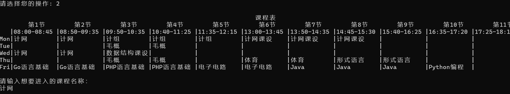
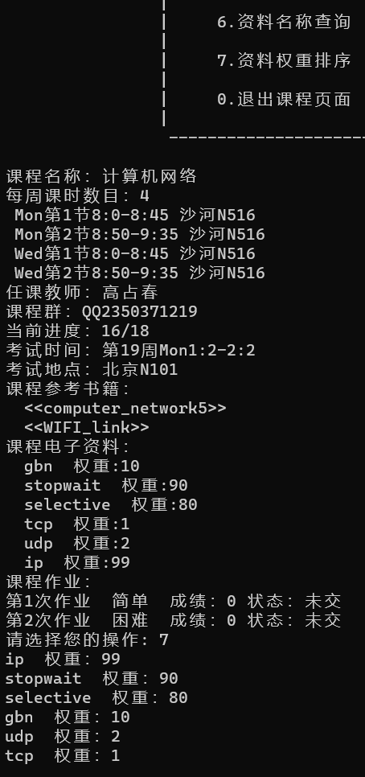
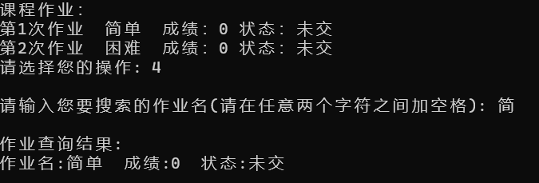
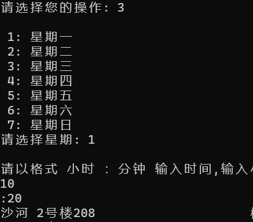
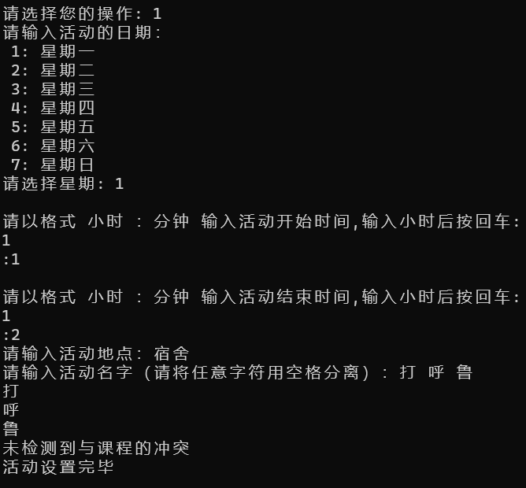
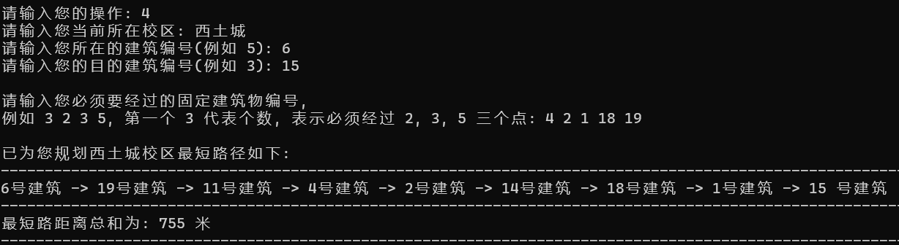
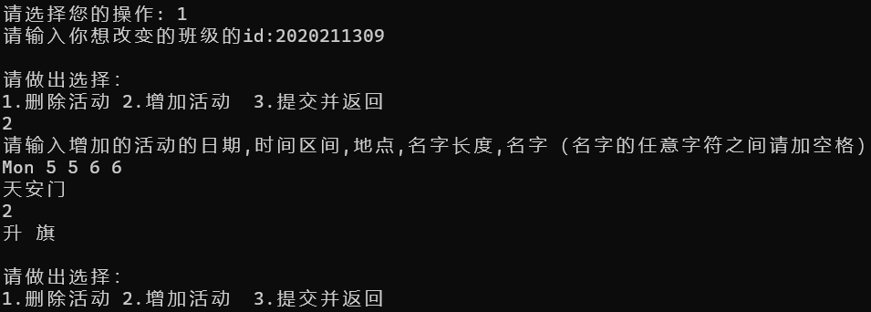
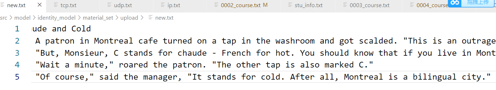
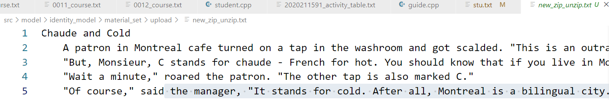
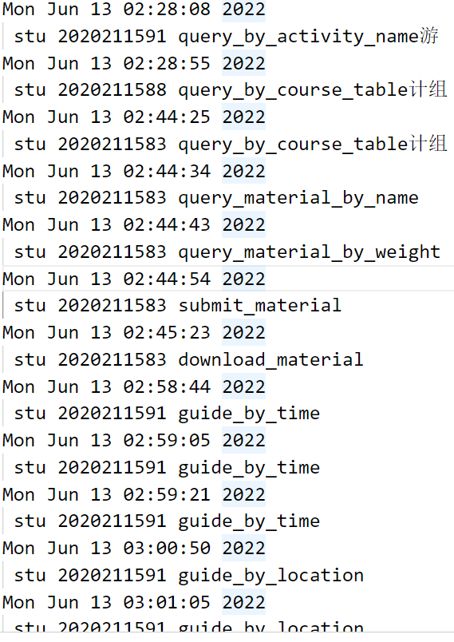

# 数据结构课程设计报告

  // 此处写小组组员，学号姓名信息

## 1. 项目概述
- 采取在终端进行交互的方式，通过命令行来进行信息的输入和输出。
- 没有考虑到多用户互联,是一个单机版程序。
- 所有交互菜单放在 `menu.cpp` 中。
- 程序分为三个大模块 `identity_model` (三个基本模块的组合),`course_model` 以及 `navigation_model` ,分别负责用户的基本操作，与课程有关的操作以及和导航有关的操作，其中以 `identity_model` 为核心。
- `identity_model` 由 `student_model` ,`teacher_model` ,`admin_model` 三个子模块组合而成，分别负责学生（基本用户），老师（发布和批改作业），管理员（统一管理系统）的基本操作，其中以    `student_model` 为核心，`student_model` 可以实现课程信息管理，课外信息管理，课程路径导航以及课程内部的相关功能。
- 除`navigation_model`外，每个基本模块的代码存储在同名`.h`以及`.cpp`文件中，且将相关变量和函数封装在同名的类中。
- 模块依赖关系：
   `main.cpp` 是程序执行的范围，依赖所有模块。
  `student_model`依赖 `course_model`  。`navigation_model`。
  所有模块依赖`menu.cpp`. 
- 相关数据存储在项目文件夹下面的各个文件夹中。

   `course_set(存储课程信息),
    activity_set(存储个人活动信息),
   group_set(存储班级活动信息),
   material_set(存储课程资料相关信息),
   homework_set(存储作业相关文件), 
   course_table(存储每个学生的课程表),
   log(存储日志文件),
   stu / admin / tea_info.txt(存储系统用户登录信息).`
## 2.组员贡献
  周宇
-  编写课外信息管理的全部代码
- 编写除压缩和解压相关算法的课内信息管理的全部代码
- 编写时间模拟算法
- 编写admin_model和teacher_model中除了作业查重算法的全部代码

 任晓斌
- 编写导航模块的全部代码（包括途径多个地点最短路的选作算法）
- 编写AC自动机算法实现作业查重
- 构建系统基本模块框架
- 利用CMAKE实现本项目在多模块互相依赖条件下的成功编译

 孟浩洋

- 编写压缩和解压的全部代码

## 3.模块和功能
### 3.1. 用户身份模块(identity_model)

#### 3.1.1. 学生部分(stu_model)
数据结构说明和数据字典

 - 1.`map<string, string name_to_id`

   在找到正确的名字后通过名字找到对应的课程下标，通过下标可以读取课程文件创建课程类

- 2.`map<int, pair<string, string  time_to_place`

   在找到合理的时间（大于输入时间的最新上课开始时间）后必须通过时间查找到对应的地名（校区+建筑），这样学生可以实现通过时间进行导航
- 3.`string my_course_table[6][12]`

   存储学生课程表
- 4.`Node t1[1000],Node t2[1000]`

    分别是用来存储课程时间和活动时间的二叉搜索树
- 5.`map<string, vector<single_activity  name_to_activity`

    在找到正确的名字后通过名字找到对应的活动
- 6.`map<int, vector<single_activity  time_to_activity`

     在找到正确的时间后通过时间找到对应的活动
- 7.`struct single_activity`

    存储活动信息的单元
- 8.`weekly_sys_time`

     模拟时间
- 9.`weekly_real_time`

    真实时间
- 10.`map<word_to_sen,map<word_to_par`

   字符到其所属字符串的有序映射表

算法
- 利用二叉搜索树进行数据的查找，复杂度为`O(lnx)`

- 利用两区间中点的距离的绝对值和两区间总长度之间的大小关系方便的检测冲突
- dijstra算法进行最短路计算
- 利用多线程以及时间差的存储，缩放实现模拟系统时钟的暂停和快进
- 将所有组成可能被搜索的名字中的字符存进内存，与用户输入进行匹配来实现模糊查询；考虑到所有条目的名字总长度很短，所以所占内存空间可以接受，而且搜索复杂度低至`O(klogn)`(k为搜索字符长度，n为全部字符长度)

实现的功能

- 1.课程名称模糊查询  
  
 -   2.课表课程查询    
     
 -  3.课程时间查询    
    
-   4.活动名称模糊查询    
    
 -   5.进入活动菜单（进入后可以对个人活动增删改，还可以对活动按照类别进行查找后按照时间排序)    
     
-    6.活动时间查询    
     
 -    7.进行路径导航 

 -  8.模拟时间暂停

 - 9.模拟时间快进
 - 10.活动闹钟提醒 (以模拟时间为准，通过输出"\a"模拟闹铃)

  与其他模块交互

 - 1.可以通过课表查询或者课程名称查询创建course实例，完成学生所需要的与课程有关的功能 
 - 2.与活动相关的功能都在本模块内部实现
 - 3.通过路径导航功能可以创建guide实例，实现学生的导航需求

 #### 3.1.2.管理员用户
 数据结构说明和数据字典
- 1.`struct single_course_a`

  一堂课
- 2.`whole_course_a`

  一门课
- 3.`single_activity_a`

  一次活动

实现的功能
- 1.班级活动菜单（对班级活动进行增加和删除）

- 2.发布新的课程
- 3.修改原有课程
- 4.根据活动类型进行查找并且将结果按照时间排序

与其他模块交互
- 管理员对文件的修改将会影响到其他用户在之后读取各种数据的情况
#### 3.1.3. 教师用户
数据结构说明和数据字典
- `map<string, string name_to_id`
  存储从文件中读到的课程名和id的映射 
算法
- 解压缩

实现的功能
- 发布作业
- 批改作业

与其它模块的交互

- 发布作业后选了该课程的所有学生在`homework_set`中会多出一份作业文件夹，学生可以在下一次进入该课程页面后发现老师布置了作业
- 批改作业后会把分数写入文件，学生可以在下一次进入该课程页面后看到老师给这次作业多少分
### 3.2. 学生课程模块(course_model)
数据结构说明和数据字典
  - 1.`struct single_course`

     存储一堂课的单元
  - 2.`struct material`

     存储一份电子资料的单元（包含权重信息）
- 3.`struct hw`

    存储一份作业信息的单元（包含成绩信息）
- 4.`vector<int order_hws`

    以成绩为关键字进行快速排序时，存放排序结果的下标
- 5.`vector<int order_materials`

     以权重为关键字进行快速排序时，存放排序结果的下标

实现的功能

 - 1.提交课程作业  

 -  2.提交课程资料                            
- 3.下载课程资料    
- 4.作业名称模糊查询   
 -   5.作业成绩排序    
 - 6.资料名称模糊查询   
  - 7.资料权重排序

算法

- 以下标转换为基础的快速排序，既可以节省空间，又提高效率
与其他模块交互
- 学生用户可以在个人主页中通过课程表选定课程或者通过搜索来创建课程类实例并进入课程界面实现课程提供的各种功能
## 4.算法和数据结构分析
### 4.1.通过下标的转换进行快速排序
 场景
- 在进行资料按照权重进行排序，或者作业按照分数进行排序时

 采用理由

- 原始数据完全无序，采用快速排序效率最高
- 考虑到单个作业结构体或者资料结构体所占空间较大，我们在排序时只移动保存在另一个数组中的下标，可以节约无用数据进行转移耗费的时间。

 分析

- 
### 4.2.二叉搜索树
 场景
- 对课程和活动时间进行查询时使用

 采用理由

- 用户期望在输入一个时间后，能够得到这个时间之后离它最近的那个数据。通过二叉搜索树，这可以在`O(ln n)` 时间内实现。
- 用户在期望按照时间进行排序，而通过二叉搜索树不必建立新的数组进行排序，只需要进行一次遍历。
- 用户可能对活动进行大量的添加，树形结构可以保证结点的变化所导致的数据转移消耗较低。

 分析

- 假设数据量为n.
 程序中通过 `kth( rank( time+ 1) )` 来找到time的后继：
  `rank(x+1)`通过后序遍历返回x的后继的排名，`kth(y)`通过后序遍历返回排名y的数据的值
  两个后续遍历复杂度均为O(ln n)，则只需要`O(ln n)`复杂度即可得到结果
- 通过`insert(x)`来添加结点，依然采用后序遍历，则可以在`O (ln n)`时间内完成活动的添加。
### 4.3.利用端点和中点坐标的冲突检测算法
  场景
 - 在用户设置活动或者查看活动时，需要检测是否与课程存在冲突

  采用理由
 - 代码简洁高效

 分析
 - 回忆中学判断两个圆的位置关系，关键在于把握半径和圆心距之间的几何关系。类比到线段，圆心距相当于中点距，半径相当于端点距离。
 ### 4.4.编码和解码
 ### 4.5.AC自动机
 ### 4.6.最短路

## 5.执行效果
课程表

## 

作业名称查询

资料权重排序

课程名称查找

根据输入时间给出下一节课的教室

学生设置个人活动并进行冲突检测

选做功能：实现经过多个地点的最短路径导航

管理员设置

压缩解压测试

---------
部分日志记录

## 6. 总结和心得

## 7. 参考文献

[^1]:[参考文献](https://blog.csdn.net/qq_44628595/article/details/117350096)

[^2]: [哈夫曼压缩算法]()
