# 数据结构课程设计报告

  // 此处写小组组员，学号姓名信息

## 1. 项目概述
- 采取在终端进行交互的方式，通过命令行来进行信息的输入和输出。
- 没有考虑到多用户互联,是一个单机版程序。
- 所有交互菜单放在 `menu.cpp` 中。
- 程序分为三个大模块 `identity_model` (三个基本模块的组合),`course_model` 以及 `navigation_model` ,分别负责用户的基本操作，与课程有关的操作以及和导航有关的操作，其中以 `identity_model` 为核心。
- `identity_model` 由 `student_model` ,`teacher_model` ,`admin_model` 三个子模块组合而成，分别负责学生（基本用户），老师（发布和批改作业），管理员（统一管理系统）的基本操作，其中以    `student_model` 为核心，`student_model` 可以实现课程信息管理，课外信息管理，课程路径导航以及课程内部的相关功能。
- 除`navigation_model`外，每个基本模块的代码存储在同名`.h`以及`.cpp`文件中，且将相关变量和函数封装在同名的类中。
- 模块依赖关系：
   `main.cpp` 是程序执行的范围，依赖所有模块。
  `student_model`依赖 `course_model`  。`navigation_model`。
  所有模块依赖`menu.cpp`. 
- 相关数据存储在项目文件夹下面的各个文件夹中。

   `course_set(存储课程信息),
    activity_set(存储个人活动信息),
   group_set(存储班级活动信息),
   material_set(存储课程资料相关信息),
   homework_set(存储作业相关文件), 
   course_table(存储每个学生的课程表),
   log(存储日志文件),
   stu / admin / tea_info.txt(存储系统用户登录信息).`
## 2.组员贡献
  周宇
-  编写课外信息管理的全部代码
- 编写除压缩和解压相关算法的课内信息管理的全部代码
- 编写时间模拟算法
- 编写`admin_model`和`teacher_model`中除了作业查重算法的全部代码

 任晓斌
- 编写导航模块的全部代码（包括途径多个地点最短路的选作算法）
- 编写AC自动机算法实现作业查重
- 构建系统基本模块框架
- 利用CMAKE实现本项目在多模块互相依赖条件下的成功编译

 孟浩洋

- 编写压缩和解压的全部代码


## 3.模块和功能
### 3.1. 用户身份模块(identity_model)

#### 3.1.1. 学生部分(stu_model)
##### 3.1.1.1.数据结构说明和数据字典

 - 1.`map<string, string name_to_id`

   在找到正确的名字后通过名字找到对应的课程下标，通过下标可以读取课程文件创建课程类

- 2.`map<int, pair<string, string  time_to_place`

   在找到合理的时间（大于输入时间的最新上课开始时间）后必须通过时间查找到对应的地名（校区+建筑），这样学生可以实现通过时间进行导航
- 3.`string my_course_table[6][12]`

   存储学生课程表
- 4.`Node t1[1000],Node t2[1000]`

    分别是用来存储课程时间和活动时间的二叉搜索树
- 5.`map<string, vector<single_activity  name_to_activity`

    在找到正确的名字后通过名字找到对应的活动
- 6.`map<int, vector<single_activity  time_to_activity`

     在找到正确的时间后通过时间找到对应的活动
- 7.`struct single_activity`

    存储活动信息的单元
- 8.`weekly_sys_time`

     模拟时间，精确到秒
- 9.`weekly_real_time`

    真实时间，精确到毫秒，用于计算得到模拟时间
- 10.`map<word_to_sen,map<word_to_par>`

   字符到包含该字符的字符串的map
   这个`map`位于学生模块中，包含 `x` 项，用于模糊查找，`map`内部使用红黑树，在查找时通过对输入的 `k `个字符作为 `key`,查找对应的`value`,可以以 $O(klog x)$时间复杂度实现模糊查找。


##### 3.1.1.2.实现的功能

- 1.课程名称模糊查询  
  
 -   2.课表课程查询    
     
 -  3.课程时间查询    
    
-   4.活动名称模糊查询    
    
 -   5.进入活动菜单（进入后可以对个人活动增删改，还可以对活动按照类别进行查找后按照时间排序)    
     
-    6.活动时间查询    
     
 -    7.进行路径导航 

 -  8.模拟时间暂停

 - 9.模拟时间快进
 - 10.活动闹钟提醒 (以模拟时间为准，通过输出"\a"模拟闹铃)
##### 3.1.1.3.算法及分析
###### 3.1.1.3.1.二叉搜索树
 场景
- 对课程和活动时间进行查询时使用

 优缺点

- 用户期望在输入一个时间后，能够得到这个时间之后离它最近的那个数据。通过二叉搜索树，这可以在`O(ln n)` 时间内实现。
- 用户在期望按照时间进行排序，而通过二叉搜索树不必建立新的数组进行排序，只需要进行一次遍历。
- 用户可能对活动进行大量的添加，树形结构可以保证结点的变化所导致的数据转移消耗较低。
- 在特殊情况下，二叉搜索树会失衡，性能将会逼近链表。

 分析
- 二分查找复杂度分析:
  最坏情况：假设所要查找的数据在树中最后一层，那么查找次数`k`满足$2^k=n$,$k=logn$。
  最坏复杂度=$O(log   n)$
- 假设数据量为n.
 程序中通过 `kth( rank( time+ 1) )` 来找到time的后继：
 ```cpp
 int Student::rank(int x, int root, Node -t) {
    if (root) {
        if (x < t[root].value)
            return rank(x, t[root].left, t);
        if (x > t[root].value)
            return rank(x, t[root].right, t) + t[t[root].left].size + t[root].num;
        return t[t[root].left].size + t[root].num;
    }
    return 1;
}

int Student::kth(int x, int root, Node -t) {
    if (x <= t[t[root].left].size) return kth(x, t[root].left, t);
    if (x <= t[t[root].left].size + t[root].num) return t[root].value;
    return kth(x - t[t[root].left].size - t[root].num, t[root].right, t);
}
 ```
  `rank(x+1)`通过分治查找返回x的后继的排名，`kth(y)`通过分治查找返回排名y的数据的值。两个二分查找复杂度均为$O(log n)$，则只需要$O(log n)$复杂度即可得到结果
- 通过`insert(x)`来添加结点，依然采用分治，则可以在$O (log n)$时间内完成活动的添加。
```cpp
void Student::insert(int x, int root, Node -t, int &cnt) {
    if (x < t[root].value)
        if (!t[root].left)
            t[t[root].left = ++cnt] = Node(0, 0, 1, x);
        else
            insert(x, t[root].left, t, cnt);
    else if (x > t[root].value)
        if (!t[root].right)
            t[t[root].right = ++cnt] = Node(0, 0, 1, x);
        else
            insert(x, t[root].right, t, cnt);
    else
        t[root].num++;
    update(root, t);
}
```
###### 3.1.1.3.2.利用端点和中点坐标的冲突检测算法
  场景
 - 在用户设置活动或者查看活动时，需要检测是否与课程存在冲突

  采用理由
 - 代码简洁高效
```cpp
bool Student::interact(int x1, int x2, int y1, int y2) {
    return (x1 + y1 - x2 - y2 <= x1 + x2 - y1 - y2) && (x1 + x2 - y1 - y2 <= x2 + y2 - x1 - y1);
}
```
 分析

 - 回忆中学判断两个圆的位置关系，关键在于把握半径和圆心距之间的数量关系。类比到线段，圆心距相当于中点距，直径相当于端点距离。


  ##### 3.1.1.4与其他模块交互

 - 1.可以通过课表查询或者课程名称查询创建course实例，完成学生所需要的与课程有关的功能 
 - 2.与活动相关的功能都在本模块内部实现
 - 3.通过路径导航功能可以创建guide实例，实现学生的导航需求
##### 3.1.1.5执行效果
- 课程名称查询

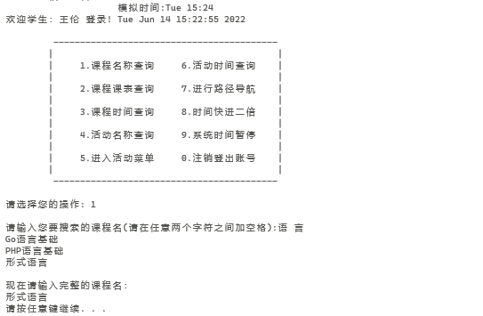

- 活动类型查询

  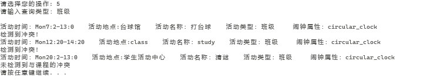

- 学生设置活动

  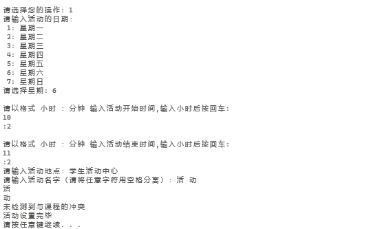

- 课程课表查询

  

- 活动名称查找

  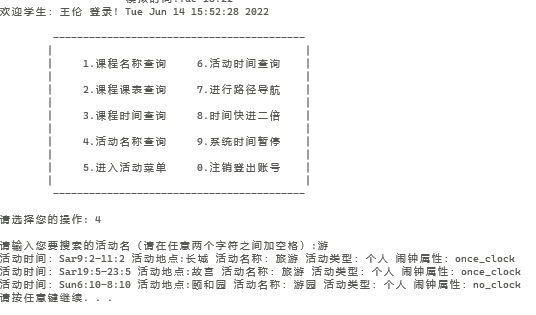

  - 活动页面

    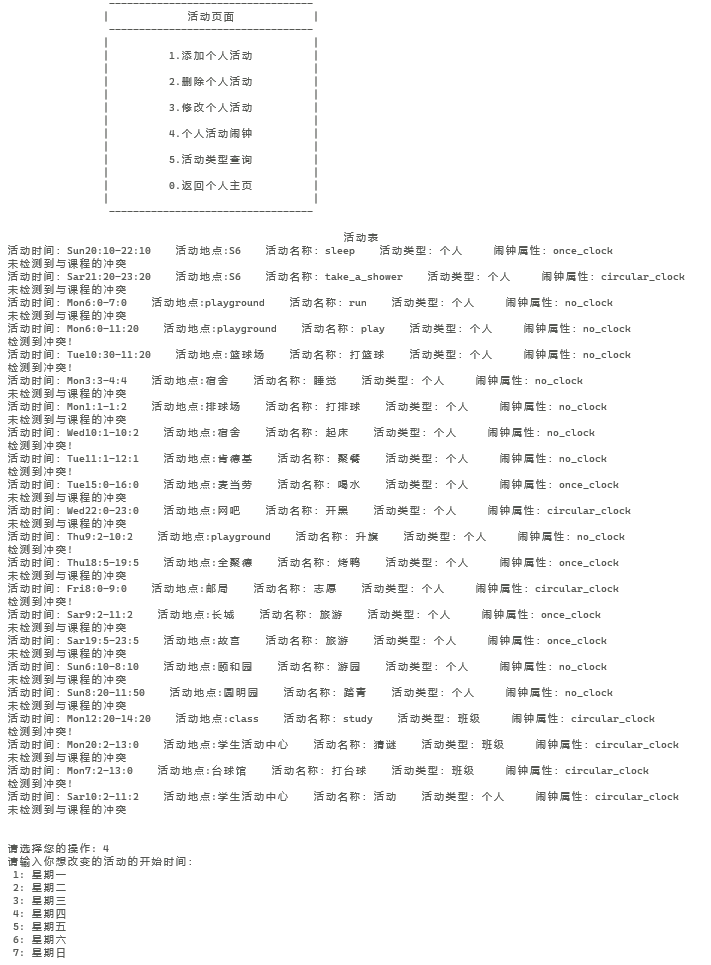

 #### 3.1.2.管理员用户
 ##### 3.1.2.1.数据结构说明和数据字典
- 1.`struct single_course_a`

  一堂课，管理员在修改课程时需要将文件内容存储到该结构体中，在内存中对该结构体进行修改后再重新存入文件
- 2.`whole_course_a`

  一门课，管理员在发布课程时需要在内存中对该结构体的变量进行赋值后再新建相关文件
- 3.`single_activity_a`

  一次活动，管理员在修改班级活动时需要将班级活动文件内容存储到该结构体中，在内存中对该结构体进行修改后再重新存入文件

##### 3.1.2.2.实现的功能
- 1.班级活动菜单（对班级活动进行增加和删除）

- 2.发布新的课程
- 3.修改原有课程
- 4.根据活动类型进行查找并且将结果按照时间排序

##### 3.1.2.3.与其他模块交互
- 管理员对文件的修改将会影响到其他用户在之后读取各种数据的情况
##### 3.1.2.4执行效果
- 管理员修改考试时间

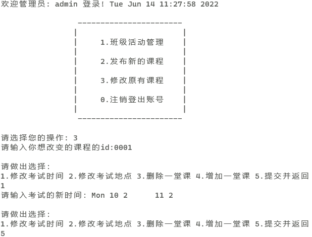

- 管理员发布班级活动

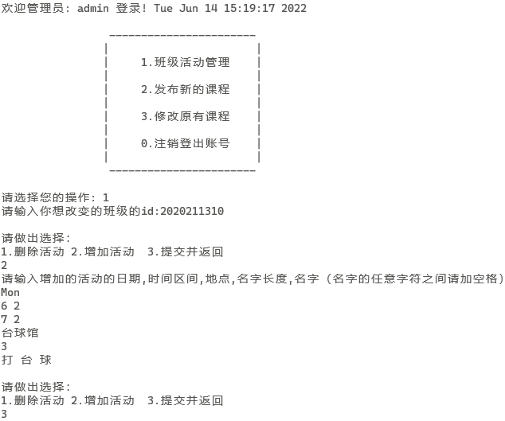


#### 3.1.3. 教师用户
##### 3.1.3.1.数据结构说明和数据字典
- `map<string, string name_to_id`
  存储从文件中读到的课程名和id的映射，用户在输入课程名称后可以进入到课程文件中读取信息。 


##### 3.1.3.2.实现的功能
- 发布作业
- 批改作业
##### 3.1.3.3.算法及分析
- 解压缩
##### 3.1.3.4.与其它模块的交互
- 发布作业后选了该课程的所有学生在`homework_set`中会多出一份作业文件夹，学生可以在下一次进入该课程页面后发现老师布置了作业
- 批改作业后会把分数写入文件，学生可以在下一次进入该课程页面后看到老师给这次作业多少分
##### 3.1.3.5执行效果
教师布置作业

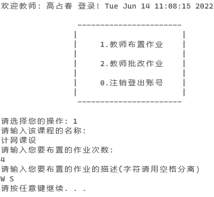

教师批改作业

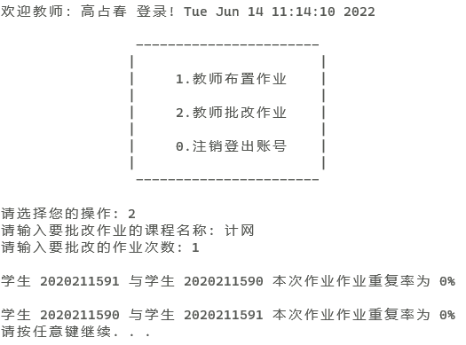


### 3.2. 学生课程模块(course_model)
#### 3.2.1.数据结构说明和数据字典
  - 1.`struct single_course`

     存储一堂课的信息单元
  - 2.`struct material`

     存储一份电子资料的单元（包含权重信息）
- 3.`struct hw`

    存储一份作业的信息单元（包含成绩信息）
- 4.`vector<int order_hws`

    以成绩为关键字进行快速排序时，存放排序结果的下标
- 5.`vector<int order_materials`

     以权重为关键字进行快速排序时，存放排序结果的下标

#### 3.2.2.实现的功能

 - 1.提交课程作业  

 -  2.提交课程资料                            
- 3.下载课程资料    
- 4.作业名称模糊查询   
 -   5.作业成绩排序    
 - 6.资料名称模糊查询   
  - 7.资料权重排序
#### 3.2.3.算法及分析

##### 3.2.3.1通过下标的转换进行快速排序
 场景
- 在进行资料按照权重进行排序，或者作业按照分数进行排序时

 优缺点

- 原始数据完全无序，采用快速排序效率最高
- 考虑到单个作业结构体或者资料结构体所占空间较大，我们在排序时只移动保存在另一个数组中的下标，可以节约无用数据进行转移耗费的资源。

 分析
 ```cpp
 void Course::qsort_m(int l, int r) {
    int i = l, j = r, flag = materials[order_materials[(l + r) / 2]].weight, tmp;
    do {
        while (materials[order_materials[i]].weight > flag) i++;
        while (materials[order_materials[j]].weight < flag) j--;
        if (i <= j) {
            tmp = order_materials[i];
            order_materials[i] = order_materials[j];
            order_materials[j] = tmp;
            i++;
            j--;
        }
    } while (i <= j);
    if (l < j) qsort_m(l, j);
    if (i < r) qsort_m(i, r);
}
 ```
- 考虑到最好情况，假设每次都是均匀划分，则运算成本为：
  $T(n) =2 - T(n/2) + n$
  递归展开后：
  $T(n) = 2 - 2[T(n/4) + n/2] + n = 2^kT(n/(2^k)) + kn$
  最后结束于T(1), 即：$2^k=n$
  可得：
  $T(n) = Cn + nlogn$
  不难看出复杂度为$O(nlogn)$。
##### 3.2.3.2 压缩文件

场景

- 学生提交作业和提交材料  

算法实现

- 哈夫曼树的结构为

```cpp
struct zipnode {
    int val;//保存字母的权值
    char ch;//保存字母
    zipnode -l, -r;//结点的左右孩子，初始时设置为空
    zipnode(int v, zipnode- lc = nullptr, zipnode- rc = nullptr) : val(v), l(lc), r(rc){};
};
struct cmp { //使用堆的优先排列生成树
    bool operator()(zipnode- a, zipnode- b) {
        return a->val > b->val;
    }
};
```

- 有关量定义

```cpp
unsigned int zip_lenstr;//记录文档的长度
zipnode- rt = nullptr;//初始化哈夫曼树
map<char, string> zip_code;//记录哈夫曼树生成的字符与对应的编码
string zip_text;//压缩后的文件以字符串的形式保存
```


- 在处理需要压缩的文件时，采用二进制方式读取文件

  ```cpp
  in.open(pathname, ios::binary);
  ```

  

- 采取堆的优先排列生成哈夫曼树,时间复杂度为$O(nlog(n))$同时输出字母及其ASCII码对应的数值，以及字母对应的编码

  ```cpp
  priority_queue<zipnode-, vector<zipnode->, cmp> Q;
  for (auto x : cnt) {
          zipnode- p = new zipnode(x.second);
          p->ch = x.first;
          Q.push(p);
      }
  while (Q.size() >= 2) {
          zipnode- lc = Q.top();
          Q.pop();
          zipnode- rc = Q.top();
          Q.pop();
          rt = new zipnode(lc->val + rc->val, lc, rc);
          Q.push(rt);
      }
  dfs(rt, "");//哈夫曼树的优先遍历
  for (auto x : zip_code) {
          if (isprint(x.first)) cout << x.first;
          cout << "/" << (int)x.first << " : " << x.second << endl;
      }
  ```

- 对哈夫曼树进行深度优先遍历，时间复杂度为$O(n)$,`dfs`函数如下

```cpp
void dfs(zipnode- p, string s) {
    if (p->l == nullptr && p->r == nullptr) {
        zip_code[p->ch] = s;
        return;
    }
    if (p->l != nullptr) dfs(p->l, s + '0');
    if (p->r != nullptr) dfs(p->r, s + '1');
}
```

- compress的逻辑如下。`str`是输入的作业地址，由学生输入作业次数等信息后自动生成，`buildText`函数用于生成哈夫曼树以及对原文件进行二进制读入，`writeZip`函数将编码以及哈夫曼树的信息写入新生成的压缩文件中。

```cpp
void compress(string str) {
    cout << "compress启动成功" << endl;
    buildText(str.c_str());
    int pos = str.find_last_of('.');
    string str1 = str.substr(0, pos);
    str = str1 + "_zip.txt";//将新生成的文件命名为XXX_zip.txt
    writeZip(str.c_str());
}
```

优点

-  由于压缩的文件不需要被看到,而二进制文件储存相对来说占空间小。于是参考了对二进制文件的处理方式，选择用二进制文件存储压缩后的信息，简单高效。


##### 3.2.3.3 解压缩文件

场景：

- 学生下载资料，老师批改作业

算法实现

- 有关量定义

```cpp
    unsigned int unzip_lenstr; //记录哈夫曼码的长度
    pair<char, int> unzip_chlen[257];//存放生成的码表，包括字符和权值，最多存放257对信息
    map<char, string> unzip_code;//存放解压缩前的字母信息
    map<string, char> unzip_decode;//存放解压缩后的字母信息
    string unzip_text; //存放压缩文件中的编码信息
```

- decompress逻辑如下，`str`存放的是需要解压缩的文件地址，` loadZip	`函数读入压缩后的文件，生成码表，并且解压缩；`unzip`函数将解压缩后的内容存放在_zip_unzip.txt文件中。

```cpp
void decompress() {
    string str;
    cin >> str;
    loadZip(str.c_str());
    int pos = str.find_last_of('.');
    string str1 = str.substr(0, pos);
    str1 += "_unzip.txt";//命名压缩后的文件。由于是压缩后再解压缩的，因此名字后缀改成_zip_unzip.txt
    unzip(str1.c_str());
}
```

- 函数`buildCodeTable`作用是将压缩文件中的如何解压缩的信息读入并且生成码表，由函数`loadZip`调用。程序可以自行生成码表，不需要手动输入，方便操作。

```cpp
void buildCodeTable(int n) {//建立编码列表函数 
	int now = 1;
	for (int i = 0; i < n; ++i) {
		char now_char = unzip_chlen[now].first;
		unzip_code[now_char] += unzip_text[i];
		if (unzip_code[now_char].length() == unzip_chlen[now].second) {
			unzip_decode[unzip_code[now_char]] = now_char; 
			now++;
		}
	}
}
```

优缺点：

- 解码信息存储在文件中，不必手工输入，操作简单
- 由于和其他函数交互的原因，一次解压后再次解压会出现乱码
#### 3.2.4.与其他模块交互
- 学生用户可以在个人主页中通过课程表选定课程或者通过搜索来创建课程类实例并进入课程界面实现课程提供的各种功能
#### 3.2.5.执行效果
- 提交课程资料

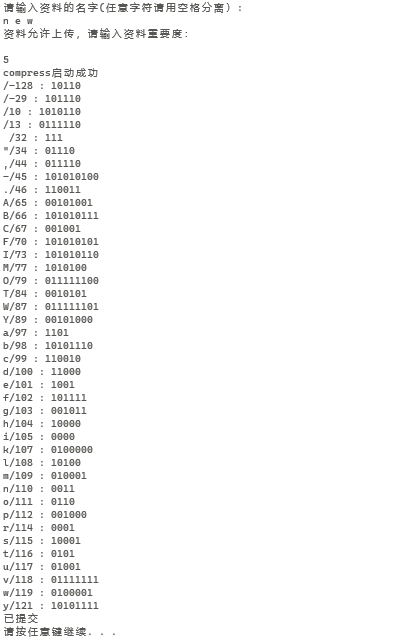

- 资料权重排序

  

- 作业名称查询

  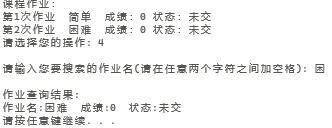

  

压缩解压测试


---------

## 6. 总结和心得


## 7. 参考文献


[^1]: [哈夫曼压缩算法](https://zhuanlan.zhihu.com/p/144562146)
[^2]: [二进制文件处理](http://c.biancheng.net/view/302.html)